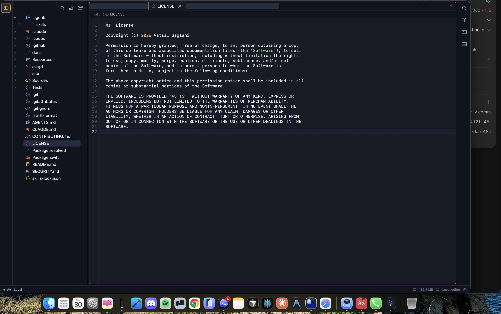
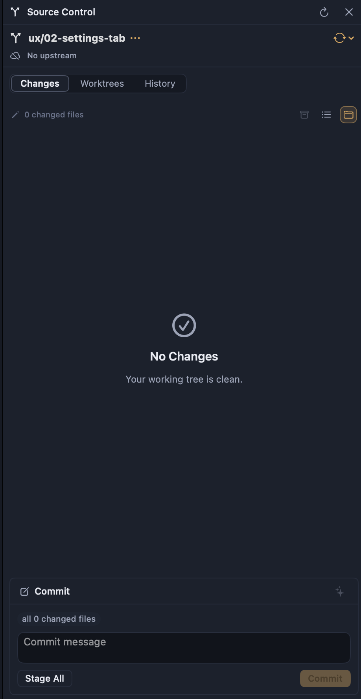
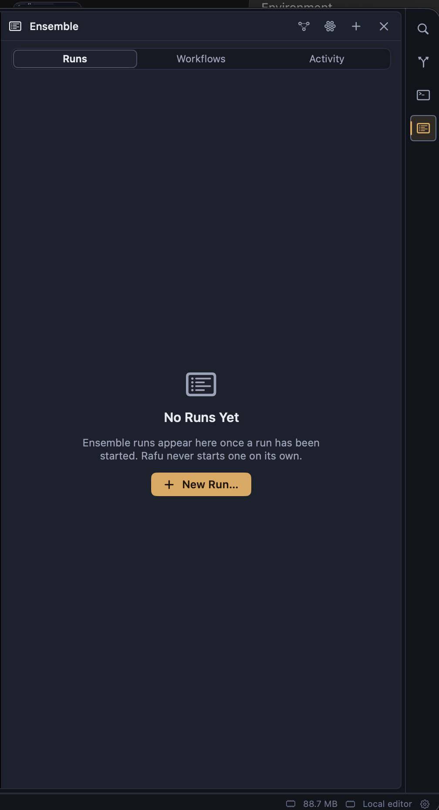
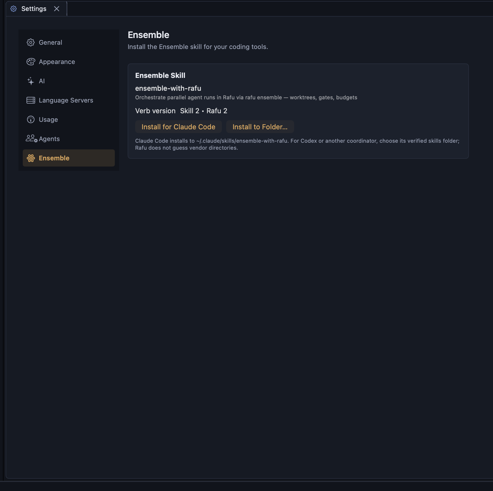
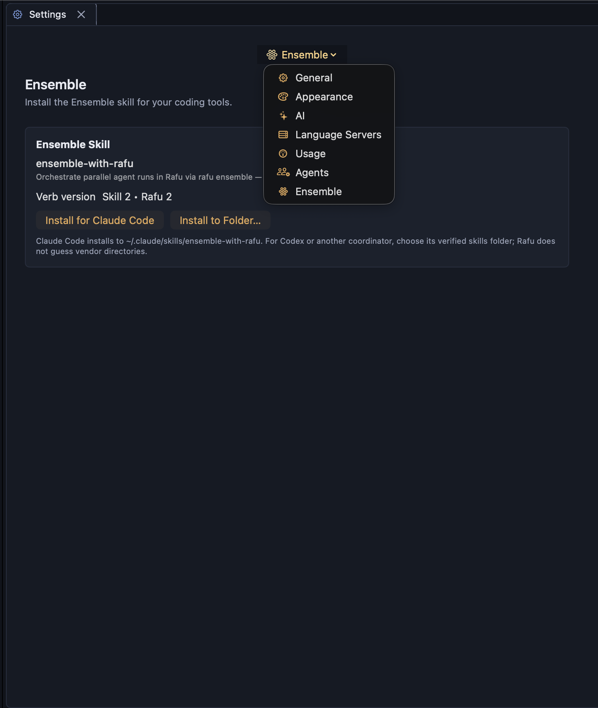
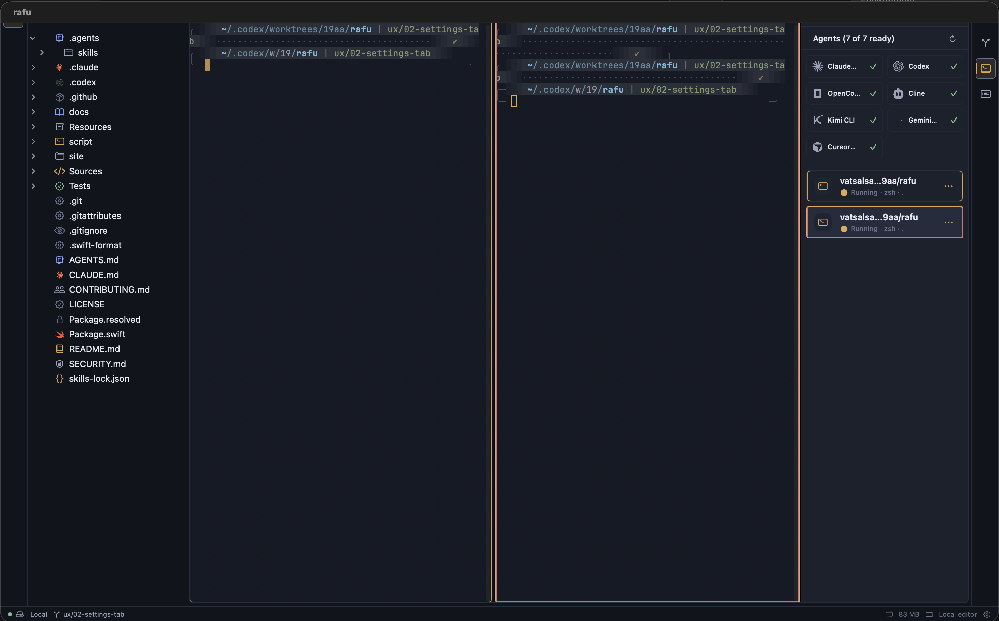
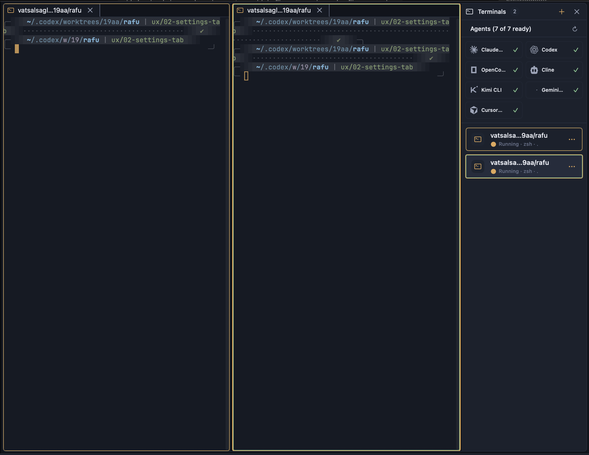
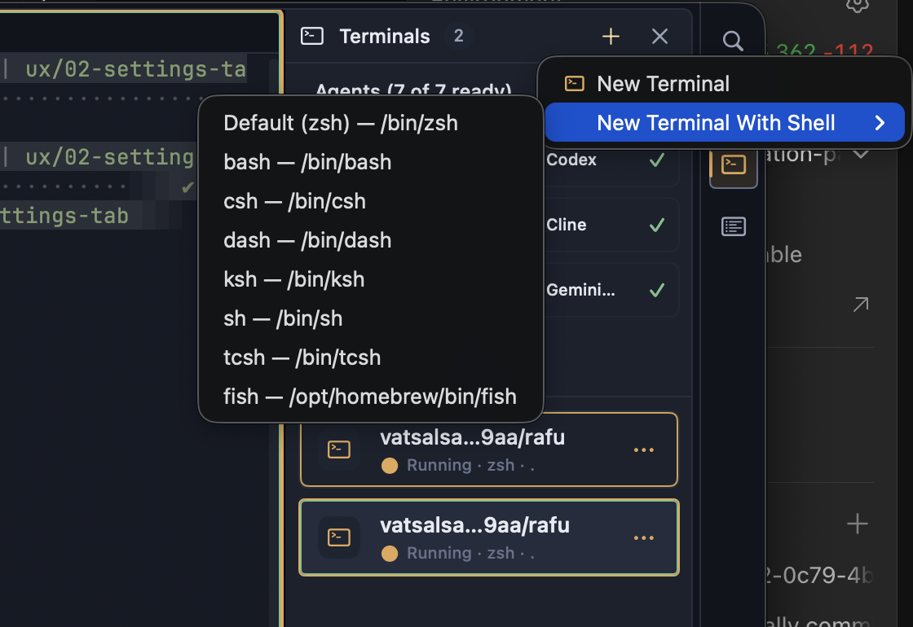
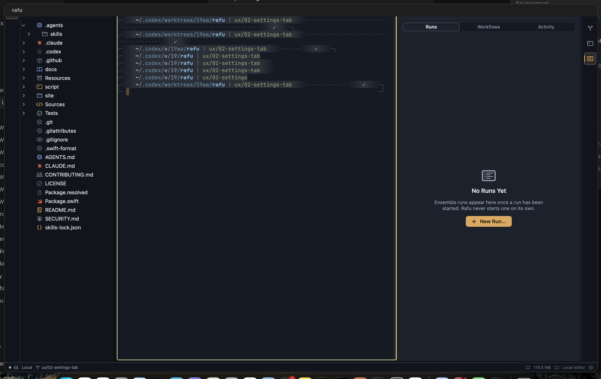

# Workbench presentation follow-up ledger

This file collects presentation bugs and improvement requests found while
reviewing the merged workbench upgrade. It remains the symptom/evidence ledger;
the implementation contracts are WP-71 through WP-74 under
[`workbench-presentation-upgrade/`](../plans/phases/workbench-presentation-upgrade/README.md).
All four plans start from one exact follow-up base and can run concurrently.

Observed build:

- Integration HEAD: `f1a276720fcf68b940da4927522fcfbf5e23cde0`
- App variant: Rafu Lightning
- Display: 2× built-in Retina

## Intake

| ID | Type | Status | Area | Summary | Plan |
|---|---|---|---|---|---|
| WBP-001 | Bug | Open | Editor tab strip | With multiple files open, only the active file's named tab remains visible | [WP-71](../plans/phases/workbench-presentation-upgrade/WP-71-editor-interactions.md) |
| WBP-002 | Improvement | Open | Utility panel tabs | Source Control tabs hug their labels instead of stretching across the panel like Ensemble | [WP-73](../plans/phases/workbench-presentation-upgrade/WP-73-responsive-navigation.md) |
| WBP-003 | Presentation defect | Open | Settings responsive layout | Settings looks coherent at wide widths but loses hierarchy and polish at narrow widths | [WP-73](../plans/phases/workbench-presentation-upgrade/WP-73-responsive-navigation.md) |
| WBP-004 | Bug | Open | Window chrome and editor splits | Dragging a tab to create a split makes the native title bar reappear | [WP-72](../plans/phases/workbench-presentation-upgrade/WP-72-window-chrome-lifecycle.md) |
| WBP-005 | Presentation defect | Open | Terminal focus and identity | The theme-colored group border overpowers the selected terminal's identity border | [WP-74](../plans/phases/workbench-presentation-upgrade/WP-74-terminal-hierarchy-picker.md) |
| WBP-006 | Improvement | Open | New Terminal flow | The nested native shell menu should become a polished Rafu shell picker | [WP-74](../plans/phases/workbench-presentation-upgrade/WP-74-terminal-hierarchy-picker.md) |
| WBP-007 | Bug | Open | Window chrome and tab closing | Closing a file or terminal tab makes the native title bar reappear | [WP-72](../plans/phases/workbench-presentation-upgrade/WP-72-window-chrome-lifecycle.md) |
| WBP-008 | Bug | Open | Find focus | Command-F or Control-F opens Find without moving keyboard focus to its input | [WP-71](../plans/phases/workbench-presentation-upgrade/WP-71-editor-interactions.md) |

## WBP-001 — Inactive file tabs disappear

- **Type:** Bug
- **Status:** Open
- **Area:** Editor → multi-document tab strip
**Plan:** [WP-71 — Editor tab visibility and Find focus routing](../plans/phases/workbench-presentation-upgrade/WP-71-editor-interactions.md)

### Observed

When multiple files are open in one editor group, the selected file keeps its
named tab, but the other open files are hidden instead of remaining visible as
inactive tabs. In the captured state, `LICENSE` is the only identifiable tab
even though multiple files are open and the tab strip has substantial available
width.

This removes the visible model of the open-file set and makes direct switching
between open files impossible from the tab strip.

### Expected

Every open file should retain an identifiable tab while horizontal space is
available. The selected tab should receive the active treatment without causing
inactive tabs to disappear. Overflow should begin only when the measured tab
content genuinely exceeds the available strip width, and every overflowed file
must remain reachable.

### Reproduction

1. Open a workspace in Rafu Lightning.
2. Open at least three files into the same editor group.
3. Select one of the open files.
4. Observe that only the selected file name is visible in the tab strip.

### Evidence

### Acceptance criteria

- With two or more files open and sufficient width, every open file has a
  visible, named tab.
- Selecting a file changes only active/inactive presentation; it does not remove
  sibling tabs.
- Tab identity, dirty state, close affordance, hover, pressed, keyboard focus,
  and inactive-window state remain distinguishable.
- Narrow widths use the intended overflow behavior without losing access to any
  open file.
- Tab selection, closing, reordering, restoration, and split-group ownership
  remain unchanged.
- The result is verified at 1× and 2×, with bundled and user JSON themes,
  Increase Contrast, larger text, keyboard-only navigation, and VoiceOver.

### Scope note

WP-71 owns the bounded implementation. This ledger records the observed
symptom and acceptance contract.

## WBP-002 — Utility panel tabs should fill the available width

- **Type:** Improvement
- **Status:** Open
- **Area:** Utility panels → segmented navigation
**Plan:** [WP-73 — Responsive utility and Settings navigation](../plans/phases/workbench-presentation-upgrade/WP-73-responsive-navigation.md)

### Observed

Source Control's `Changes`, `Worktrees`, and `History` tabs size themselves to
their labels and leave unused space to the right. The Ensemble panel's `Runs`,
`Workflows`, and `Activity` tabs distribute evenly across the full available
width and feel more deliberate.

### Expected

Equivalent top-level tab sets in utility panels should follow the same
full-width, equal-segment presentation as Ensemble. Selection should remain
clear without making one panel feel like a compact form control and another
feel like panel navigation.

### Evidence

Current Source Control treatment:

Preferred Ensemble treatment:

### Acceptance criteria

- Source Control's three tabs fill the available content width with equal
  segments.
- Other equivalent utility-panel mode selectors use the same rule unless their
  information architecture requires a documented exception.
- Selection, hover, pressed, keyboard focus, inactive-window state, and
  VoiceOver selection remain distinct.
- Labels remain legible at supported narrow widths and larger text sizes.
- Colors continue to resolve only from the active JSON theme.

## WBP-003 — Settings compact layout loses hierarchy and polish

- **Type:** Presentation defect
- **Status:** Open
- **Area:** Settings → responsive navigation and page composition
**Plan:** [WP-73 — Responsive utility and Settings navigation](../plans/phases/workbench-presentation-upgrade/WP-73-responsive-navigation.md)

### Observed

At a wide Settings canvas, the left category rail, page heading, and settings
card form a stable two-column composition. At a narrow width, navigation becomes
a floating selector above the page; its menu sits over the page hierarchy, the
selector and page content no longer share a strong alignment, and the result
feels like the wide layout was compressed instead of deliberately recomposed.

### Expected

The compact Settings mode should have an intentional narrow-width hierarchy:
category navigation should feel attached to the Settings page, page identity
should remain clear, and opening the category menu should not make the content
feel obscured or spatially disconnected.

### Evidence

Wide reference:

Narrow problem state:

### Acceptance criteria

- The regular layout remains unchanged at and above its intended breakpoint.
- Immediately below the breakpoint and at the smallest supported Settings
  width, navigation, heading, and content form one coherent vertical hierarchy.
- The compact category control has an obvious relationship to the current page
  and does not visually collide with or obscure its heading and card.
- Every category stays keyboard- and VoiceOver-reachable without horizontal
  scrolling.
- The layout survives the largest supported text size and long localized
  category names.

## WBP-004 — Splitting by dragging a tab restores the native title bar

- **Type:** Bug
- **Status:** Open
- **Area:** Window chrome → tab drag and editor split transition
**Plan:** [WP-72 — Flat window chrome across topology changes](../plans/phases/workbench-presentation-upgrade/WP-72-window-chrome-lifecycle.md)

### Observed

Dragging an editor tab to create a new split causes a tall native title-bar band
with the `rafu` window title to appear above the workbench. This breaks the
flat-window chrome and consumes additional vertical space.

### Expected

Creating, completing, cancelling, or rearranging a split must not change the
window's chrome. The same flat title-bar treatment should remain in place
before, during, and after the editor topology transition.

### Reproduction

1. Open a file or terminal tab.
2. Drag the tab to a split target.
3. Complete the split.
4. Observe the native title-bar band at the top of the window.

### Evidence

### Acceptance criteria

- No native title-bar band appears after creating, cancelling, resizing, or
  removing a split.
- The fix holds for file, terminal, Settings, and Ensemble canvas tabs.
- Key/inactive windows, full-screen entry and exit, restoration, and a second
  workspace window retain the intended chrome.
- Split geometry, drag targets, restoration, and tab ownership do not change.

## WBP-005 — Terminal borders have an unclear state hierarchy

- **Type:** Presentation defect
- **Status:** Open
- **Area:** Terminals → group focus, current selection, and session identity
**Plan:** [WP-74 — Terminal border hierarchy and shell picker](../plans/phases/workbench-presentation-upgrade/WP-74-terminal-hierarchy-picker.md)

### Observed

Split terminal groups and Terminal Manager rows can show a theme-colored
focus/group perimeter at the same time as a terminal-specific identity or
current-selection border. The theme perimeter is equally or more visually
prominent, so the selected terminal's border color loses authority and it is
difficult to tell which signal means focus, current session, or identity.

### Expected

Terminal state should have a deliberate visual hierarchy. Keyboard focus,
current/presented session, attention, and user-selected terminal identity must
remain independently understandable, with structural theme borders subordinate
to the selected terminal signal.

### Evidence

### Acceptance criteria

- Exactly one terminal reads as current when two or more sessions are visible.
- Focus and current-session treatment remain visible without covering or
  visually overpowering the session identity color.
- Editor terminal groups and corresponding Terminal Manager rows communicate
  the same state truth.
- Unfocused, inactive-window, attention, exited, uncolored, and
  background-matching identity states remain distinguishable without color
  alone.
- Increase Contrast strengthens essential structure while preserving the
  hierarchy.
- No hard-coded color or new required JSON theme key is introduced.

## WBP-006 — Replace the nested shell menu with a polished shell picker

- **Type:** Improvement
- **Status:** Open
- **Area:** Terminals → New Terminal With Shell
**Plan:** [WP-74 — Terminal border hierarchy and shell picker](../plans/phases/workbench-presentation-upgrade/WP-74-terminal-hierarchy-picker.md)

### Observed

`New Terminal With Shell` opens a second native menu containing a long,
undifferentiated list of shell names and absolute paths. The nested menu feels
detached from the new Terminal Manager presentation and gives the default shell,
alternate shells, and their paths equal visual weight.

### Expected

Shell selection should use a compact Rafu-owned picker or popover that presents
the default and available shells with clearer hierarchy while preserving exact
path truth, native keyboard operation, and accessibility.

### Evidence

### Acceptance criteria

- `New Terminal` remains the direct default-shell action.
- The alternate-shell path uses a compact, theme-coherent picker rather than a
  large nested menu.
- The default shell is clearly identified; shell name is primary and executable
  path is available as secondary text without truncating away truth.
- Full keyboard navigation, Escape, Return, pointer selection, VoiceOver, and
  larger text work correctly.
- Opening or navigating the picker never launches a shell; launch occurs only
  after an explicit selection.
- Shell discovery and process-execution behavior remain unchanged.

## WBP-007 — Closing any tab restores the native title bar

- **Type:** Bug
- **Status:** Open
- **Area:** Window chrome → file and terminal tab lifecycle
**Plan:** [WP-72 — Flat window chrome across topology changes](../plans/phases/workbench-presentation-upgrade/WP-72-window-chrome-lifecycle.md)

### Observed

Closing a file-editor or terminal tab can make the tall native title-bar band
with the `rafu` title reappear. The window chrome changes as a side effect of a
tab lifecycle action.

### Expected

Closing a tab should update only tab/group selection and content. It must not
change window style masks, title visibility, content placement, or the flat
chrome.

### Reproduction

1. Open multiple file or terminal tabs.
2. Close one of the tabs.
3. Repeat with both a file tab and a terminal tab.
4. Observe the native title-bar band appearing at the top of the window.

### Evidence

### Acceptance criteria

- Closing file, terminal, Settings, and Ensemble tabs never exposes the native
  title-bar band.
- The behavior holds when closing selected or background tabs, the final tab in
  a group, and live or exited terminals.
- Dirty-file confirmation and terminal termination behavior remain unchanged.
- Key/inactive, full-screen, restored, and two-window states keep the intended
  chrome.

## WBP-008 — Find commands do not focus the query input

- **Type:** Bug
- **Status:** Open
- **Area:** Editor → Find first-responder routing
**Plan:** [WP-71 — Editor tab visibility and Find focus routing](../plans/phases/workbench-presentation-upgrade/WP-71-editor-interactions.md)

### Observed

Pressing Command-F or Control-F reveals the Find interface but does not move the
first responder to its query field. Immediate typing continues in the editor,
which can unintentionally modify the document instead of entering a search
query.

### Expected

Invoking either supported Find shortcut should reveal Find and place keyboard
focus in its query input immediately. Typing after the shortcut must never edit
the document.

### Reproduction

1. Place the insertion point in an editable document.
2. Press Command-F or Control-F.
3. Type a search term without clicking.
4. Observe that text is inserted into the document rather than the Find field.

### Acceptance criteria

- Command-F and the supported Control-F route reveal Find and make its query
  field first responder in the active editor group.
- If Find is already visible, invoking the command focuses it and selects the
  existing query according to the established behavior.
- Immediate typing changes only the query, never document text.
- Escape returns focus to the editor without losing the query unexpectedly.
- The behavior is correct in every editor split, with multiple windows, and
  under Full Keyboard Access and VoiceOver.
