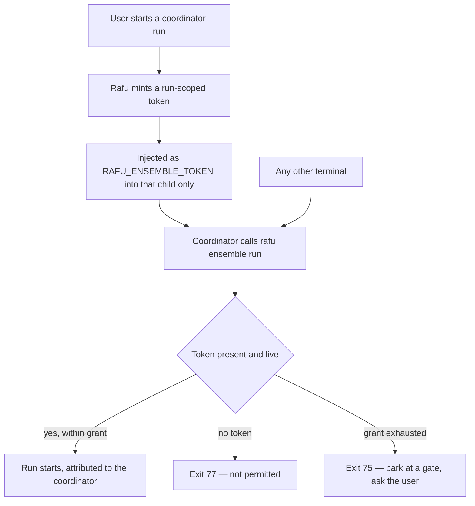
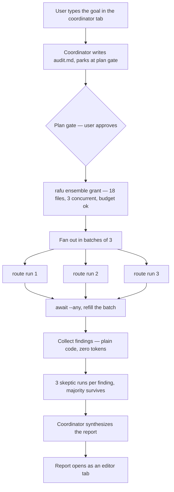
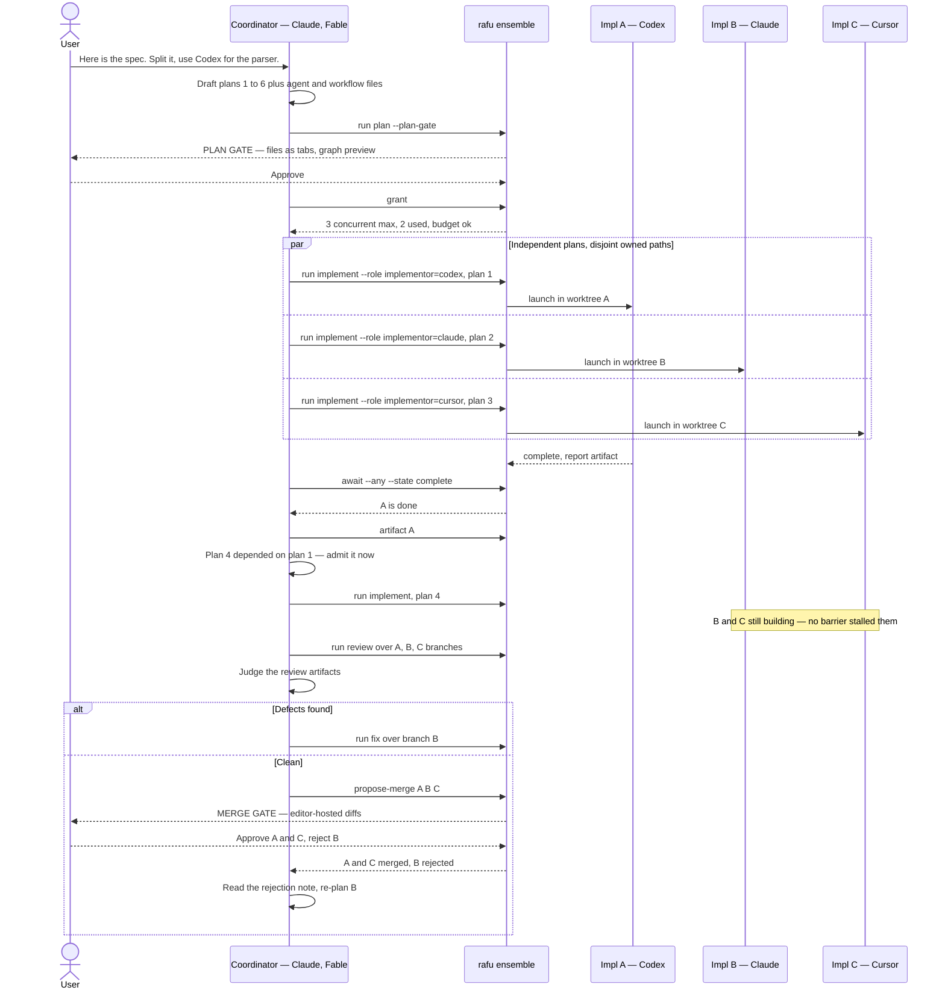
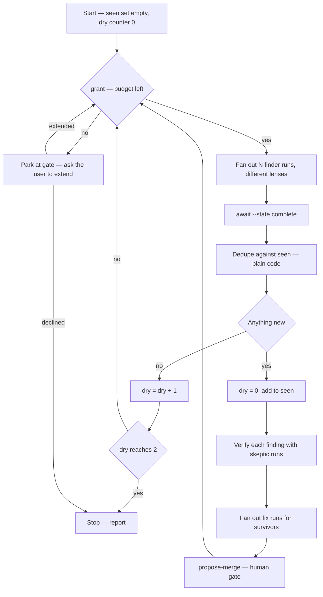
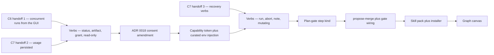

# C8 (candidate) — CLI verbs, skill pack, and worked orchestration examples

- **Status:** Design proposal (2026-07-26). Exploratory — no ADR amendment,
  no branch, no owned paths. Companion to
  [`C8-coordinator-ux.md`](C8-coordinator-ux.md).
- **Answers:** "What exactly do we add to the Rafu CLI, what goes in the
  skill pack, and how does a real orchestration play out end to end?"

## Reading order

| Document | Question it answers |
|---|---|
| [`orchestration-gap-analysis.md`](orchestration-gap-analysis.md) | Which route? (Route B, accepted) |
| [`C8-coordinator-ux.md`](C8-coordinator-ux.md) | How does it look and feel? |
| **This document** | What do we actually build, and how is it used? |

## Part 1 — The `rafu` CLI surface

### 1.1 The grammar change

Today `rafu` is flag-based: `rafu <path>`, `rafu --status`, `rafu --goto`.
Adding orchestration means a **subcommand layer**, which is a real grammar
change and must not break the existing surface.

```
rafu <path> [--new-window] [--goto ...]     # unchanged, still the default
rafu --status | --version | --help          # unchanged
rafu ensemble <verb> [args] [--json]        # NEW: subcommand namespace
```

**Resolved (2026-07-26): strict collision handling.** `ensemble` is the first
reserved subcommand, but an existing filesystem entry of that name makes the
bare invocation an `EX_USAGE` error. The diagnostic names `rafu ./ensemble`
as the path-disambiguated form; the CLI never guesses between the subcommand
and the filesystem entry.

Per `launcher-cli.md`, the whole invocation is parsed and validated **before**
any socket or side effect. That holds for the new verbs unchanged.

### 1.2 Who is allowed to call the mutating verbs

The obvious question: what stops any terminal on the machine from spawning
agent runs?

The uid check on the socket (ADR 0009) is necessary but not sufficient — it
proves *the same user*, not *an authorized coordinator*. So mutating verbs
require a **coordinator capability token**:

- When the user starts a coordinator run, Rafu mints a per-run token and
  injects it into that child's environment as `RAFU_ENSEMBLE_TOKEN`, using
  the curated-environment path that already exists
  (`conductor-pty-spawn-and-child-environment.md`).
- The token is bound to one run, carries the budget grant, and dies with it.
- Read-only verbs work without a token. **Every mutating verb requires one.**
- The token is a capability, not a credential: it authorizes spawning inside
  one grant. It unlocks no inference provider and no secret. It never appears
  in logs, manifests, or captured PTY output.



The bottom edge is the point: a stray shell hits the same check and is
refused. Authority comes from *being launched by Rafu as a coordinator*,
not from being on the machine.

### 1.3 Verb reference

| Verb | Mutating | Purpose |
|---|---|---|
| `run` | yes | Start a child run |
| `status` | no | Runs, steps, states, artifact paths |
| `await` | no | Block until runs reach a state |
| `artifact` | no | Read a handoff artifact |
| `note` | yes, bounded | Post a line to the run timeline |
| `propose-merge` | **no** | Surface a diff to the human gate |
| `abort` | yes | Stop a run this coordinator started |
| `grant` | no | Remaining budget, so the coordinator can self-pace |

`grant` matters more than it looks. Without it the coordinator plans blind
and discovers exhaustion by failing. With it, it can size the fan-out to
what is actually left — the same reasoning as budget-aware workflow scripts.

#### `rafu ensemble run`

```
rafu ensemble run <workflow> [options]
  --role <name>=<cli>[:<model>]   Bind or override a role at launch
  --input <key>=<value>           Values interpolated into the prompt
  --artifact <path>               Seed an input artifact by reference
  --base <ref>                    Branch point (default: current HEAD)
  --label <text>                  Human-readable node label on the canvas
  --detach                        Return immediately (default)
  --json                          Machine-readable result
```

```console
$ rafu ensemble run implement --role implementor=codex:gpt-5.6 \
    --artifact .rafu/runs/r-8a1/steps/01-plan-a1/plan.md \
    --label "Auth middleware" --json
{
  "runID": "r-9f2",
  "workflow": "implement",
  "worktree": "/Users/v/rafu/.rafu/worktrees/r-9f2",
  "branch": "ensemble/r-9f2-auth-middleware",
  "state": "running",
  "startedBy": "r-8a1"
}
```

**Correction (2026-07-26):** The JSON above is illustrative. Today's shipped
engine creates a worktree at
`<parentOfRepo>/.rafu-worktrees/<repo>-<runID>` on branch
`rafu/run-<id>`; the shown in-repo path and `ensemble/…` branch are not the
current file contract.

`startedBy` is never omitted. Every coordinator-started run is attributed in
the panel and canvas — the "no silent runs" rule from the gap analysis.

#### `rafu ensemble status`

```
rafu ensemble status [<run>...] [--tree] [--since <token>] [--json]
```

```console
$ rafu ensemble status --tree --json
{
  "runs": [{
    "runID": "r-8a1", "role": "coordinator", "state": "running",
    "children": [
      { "runID": "r-9f2", "label": "Auth middleware", "state": "complete",
        "artifacts": [".rafu/runs/r-9f2/steps/01-implement-a1/report.md"],
        "usage": { "provider": "codex", "deltaPercent": 3.1 } },
      { "runID": "r-9f3", "label": "Rate limiting", "state": "running",
        "step": { "index": 1, "of": 2, "name": "implement" } },
      { "runID": "r-9f4", "label": "Audit log", "state": "awaiting_gate",
        "gate": { "kind": "step", "prompt": "Schema change — review?" } }
    ]
  }],
  "cursor": "c-1183"
}
```

`usage` is present only when the provider actually reported (C7's honesty
rule — never a fabricated number). `cursor` feeds `--since` for cheap
incremental status snapshots.

#### `rafu ensemble await`

```
rafu ensemble await <run>... --state <state> [--any] [--timeout <sec>]
```

Exits 0 when the condition holds, 75 on timeout. `--any` returns on the
first run to satisfy it — that is what enables staggered fan-in, where the
coordinator starts reviewing branch A while B and C are still building.

**Implementation caveat, load-bearing:** the IPC contract began as one frame
per connection, strictly request/response (`cli-app-ipc.md`). `await`
therefore requires either client-side polling over repeated `status`
connections or a new long-lived streaming frame kind; polling would avoid a
new socket contract, and sub-second latency is irrelevant against multi-minute
agent steps. **Resolved (2026-07-26): streaming** — see the ADR 0018 amendment.
`await` and event delivery use a long-lived subscription connection with
framed events, heartbeats, and bounded buffers; one-shot verbs retain the
one-frame request/response contract.

#### `rafu ensemble propose-merge`

```
rafu ensemble propose-merge <run>... [--message <text>] [--json]
```

The critical verb. It **never merges.** It queues a diff at the human gate
and returns immediately with `"state": "awaiting_human"`. A coordinator that
calls it and then calls `await --state merged` will block until *the user*
approves. That blocking is the design working, not a bug — ADR 0018's gated
merge-back expressed as an API.

#### Exit codes

Reusing the existing convention rather than inventing one:

| Code | Meaning | Coordinator should |
|---|---|---|
| 0 | Success | Continue |
| 64 | `EX_USAGE` — bad grammar | Fix the call; do not retry verbatim |
| 65 | `EX_DATAERR` — malformed workflow/agent file | Rewrite the file, re-gate |
| 69 | `EX_UNAVAILABLE` — no Rafu listener | Stop; the app is not running |
| 75 | `EX_TEMPFAIL` — grant exhausted or timeout | Ask the user to extend |
| 77 | `EX_NOPERM` — no token, or CLI not in the allowed list | Stop; report |

## Part 2 — The skill pack

### 2.1 Why a skill and not a longer prompt

The coordinator needs to know six things: the verbs, the file formats, the
loop shape, when to fan out, when to verify, and how to behave at a gate.
That is too much for a kickoff message and it must survive context
compaction across a multi-hour run. A skill loads on demand and stays
addressable.

### 2.2 Contents

```
ensemble-with-rafu/
  SKILL.md                      # when to use, the loop, the hard rules
  references/
    verbs.md                    # full CLI reference, exit codes, JSON shapes
    file-formats.md             # agent + workflow authoring, worked examples
    patterns.md                 # fan-out, verify, diamond, loop-until-dry
    troubleshooting.md          # what each exit code means and what to do
```

`SKILL.md` carries the rules that must never be reasoned away:

- Never merge. Call `propose-merge` and wait for the human.
- Check `grant` before fan-out. Size the fan-out to what is left.
- One artifact per step, written to the path Rafu gave you.
- Exit 77 means stop and report, not retry with different arguments.
- Bind roles explicitly. Never assume a CLI is installed or authorized.

`patterns.md` is where the graph-engineering material earns its place —
these are the same primitives, expressed against Rafu's substrate:

| Graph-engineering primitive | Ensemble equivalent |
|---|---|
| `agent()` with a schema | `run` with a role whose agent file declares its artifact shape |
| `parallel()` barrier | several `run` calls, then `await --state complete` |
| `pipeline()` staggering | `await --any`, process, launch the next |
| Router node | coordinator reads an artifact, picks the next `run` |
| Verifier / adversarial vote | N review runs over the same branch, coordinator tallies |
| Worktree isolation | built in — every run gets its own (C1) |
| Loop-until-dry | coordinator loop; stop after K empty rounds |
| Budget-aware scaling | `grant` before each round |

The honest difference, worth stating in the skill so the agent does not
mis-plan: those primitives are in-process function calls that vanish when
the script exits. Ensemble's are durable, cross-vendor, and human-gated.
A `parallel()` barrier costs milliseconds; an `await` here may span a coffee
break and survive a relaunch.

### 2.3 Distribution

Bundled read-only in the app; installed on demand from
**Settings → Ensemble → Install coordinator skill…**, which writes to
`~/.claude/skills/` and the Codex equivalent, and reports where it wrote.
Same instantiate-never-edit-in-place model as C6's workflow templates.

The skill declares the CLI verb version it targets. On mismatch, `rafu
ensemble` prints one warning line naming both versions — a stale skill
degrades to a clear message, never a confusing failure.

## Part 3 — Worked examples

### 3.1 Fan-out with verification

*"Audit every route for missing auth."* One node per file, then skeptics.



Note what has **no** node: collecting and deduping findings. That is
`flatMap` and a `Set` in the coordinator's own context — deterministic,
instant, free. Spawning an agent to combine results is the classic waste.
Nothing merges here at all; a read-only audit needs no merge gate.

### 3.2 The user's actual loop

Plan in one CLI, fan out to worktrees across vendors, merge back, repeat.
This is the workflow the Ensemble itself was built with.



Three things to read off that:

- **`await --any` is why plan 4 starts while B and C are still running.**
  A barrier would have idled the coordinator until the slowest finished.
- **B's rejection is not a failure**, it is the loop working. The
  coordinator reads the user's note and re-plans. This is capability 5 from
  the gap analysis, and Rafu's engine contributes nothing to it — the
  judgment is entirely the coordinator's.
- **Rafu never decided anything.** It launched, isolated, captured, and
  gated. ADR 0018 holds unchanged.

### 3.3 Loop until dry

*"Find and fix bugs until you stop finding new ones."*



The subtle correctness point, and the one that most often gets this wrong:
**dedupe against `seen`, not against confirmed findings.** Otherwise every
finding the skeptics rejected reappears next round and the loop never
converges. The budget check at the top of each round is what makes an
unbounded loop safe to run on the user's own subscription.

## Part 4 — Build order

The original dependency sequence below explains why each stage is independently
useful and testable. The C6/C7 prerequisite stage is complete; the approved
execution mapping is authoritative for parallel wave order.



| Stage | Execution plan | Why here | Ships something usable? |
|---|---|---|---|
| C6/C7 handoffs | **Complete** (`2da406e` + `5e2ac85`) | Hard prerequisites — no fan-out, no budget, no recovery without them | Yes, independently |
| Read-only verbs + streaming | C8-02 | Zero new trust surface; a coordinator can already observe | Yes — scriptable status |
| ADR amendment | C8-01 | **Must precede any mutating code**, not follow it | Decision only |
| Token + env | C8-03 | The consent model in one place before anything uses it | No, enabling |
| Mutating verbs | C8-03 | Now safe to add | Yes — real orchestration |
| Plan gate | C8-04 | Turns the two-run workaround into one run | Yes — guided onboarding |
| `propose-merge` | C8-04 | Completes the loop | Yes — full cycle |
| Skill pack | C8-05 | Ships outside the app; iterate freely after | Yes |
| Graph canvas | C8-06 | Largest UI piece, and pure comprehension — everything works without it | Yes — the cockpit |
| Guided onboarding | C8-07 | Builds the entry sheet after the coordinator and canvas seams exist | Yes — the cold-start path |

The original rationale placed the canvas last because orchestration can work
without it. The approved execution plan moves C8-06 into wave 2 so C8-04 and
C8-07 can reuse its graph model; that dependency order supersedes the linear
diagram for implementation.

## Open questions carried forward

Unchanged from `C8-coordinator-ux.md`, plus two new ones from this spec:

1. Coordinator in the repo (read-only) or its own worktree?
2. `await` transport — polling vs. streaming frame kind.
3. One canvas per coordinator tree, or per run? The manifest has no parent
   link today; `startedBy` above is the proposed one.
4. Skill distribution — bundled, marketplace, or both?
5. Nested coordinators — recommend forbidding in v1.
6. **New:** subcommand vs. path collision — is refusing to guess and
   requiring `rafu ./ensemble` the right call, or too strict?
   **Answered (2026-07-26):** Be strict. An existing `ensemble` filesystem
   entry makes the bare invocation fail with `EX_USAGE` and a diagnostic
   naming `rafu ./ensemble`.
7. **New:** token lifetime across app relaunch. C7 marks interrupted runs;
   does a resumed coordinator get its old token, a fresh one, or must the
   user re-grant? Re-granting is safest and probably right.
   **Answered (2026-07-26):** The token dies with the app and the user must
   re-grant a resumed coordinator. Token-free `status`, `artifact`, and
   `await` remain available so it can re-orient before requesting consent.

## Related

- [`C8-coordinator-ux.md`](C8-coordinator-ux.md) — the UX design this specs out
- [`orchestration-gap-analysis.md`](orchestration-gap-analysis.md) — Route B
- ADR 0018 — consent amendment is a hard prerequisite for mutating verbs
- ADR 0009, [`../../../references/cli-app-ipc.md`](../../../references/cli-app-ipc.md) — socket, framing, uid check
- [`../../../references/launcher-cli.md`](../../../references/launcher-cli.md) — existing grammar and exit-code conventions
- [`../../../references/conductor-pty-spawn-and-child-environment.md`](../../../references/conductor-pty-spawn-and-child-environment.md) — curated env, where the token rides
- [`../../../references/conductor-file-contracts.md`](../../../references/conductor-file-contracts.md) — agent/workflow formats the skill teaches
