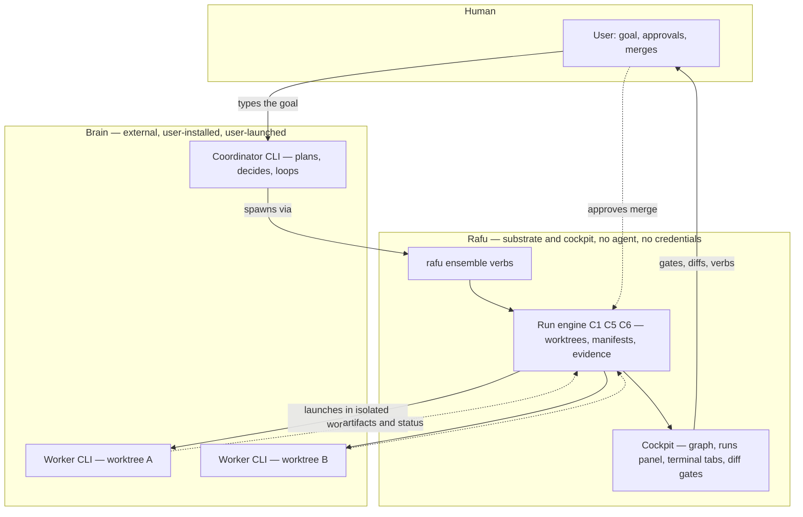
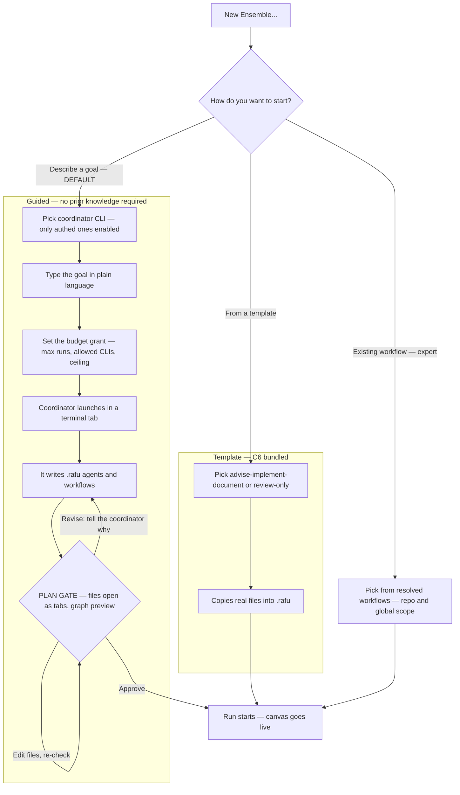
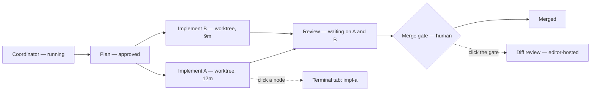
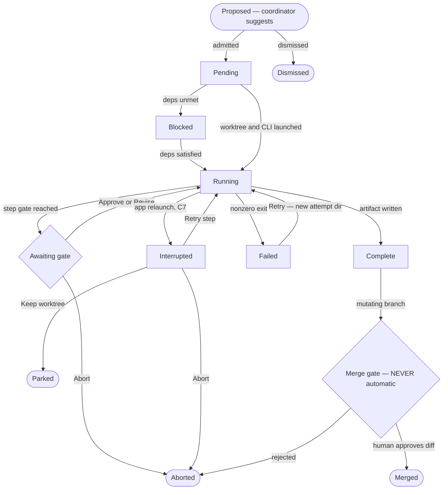
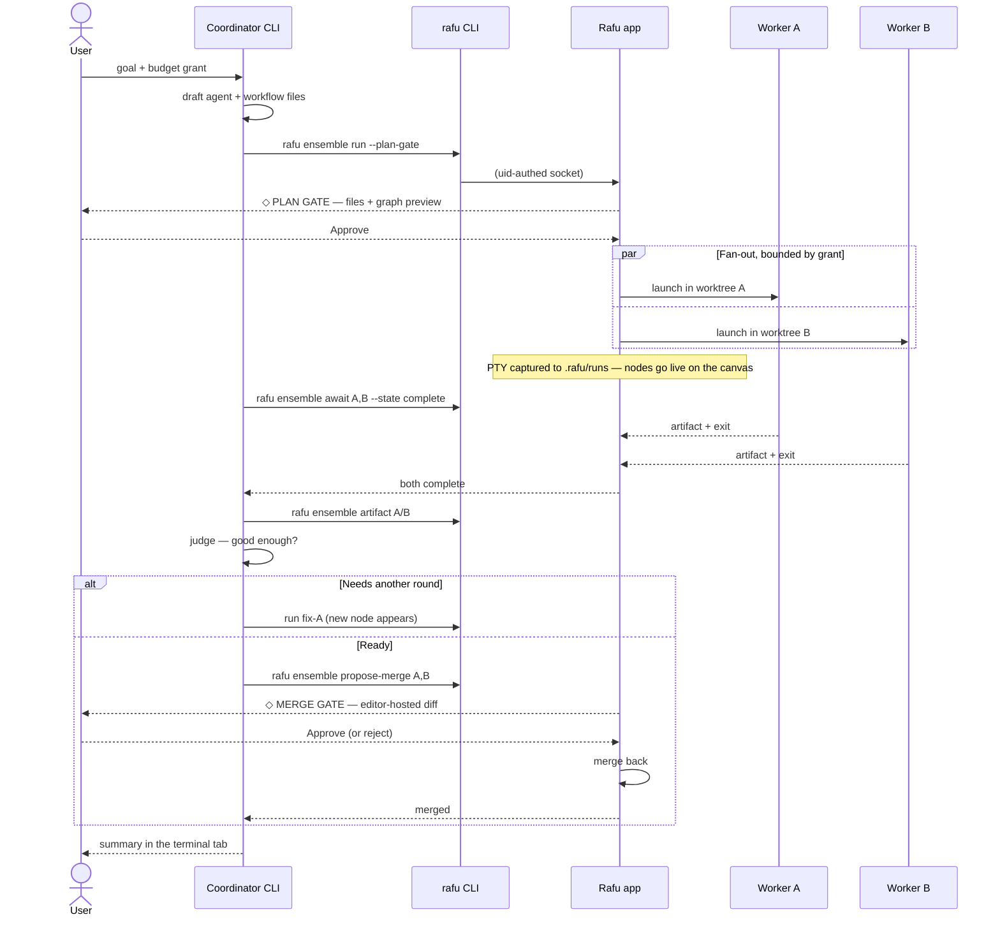
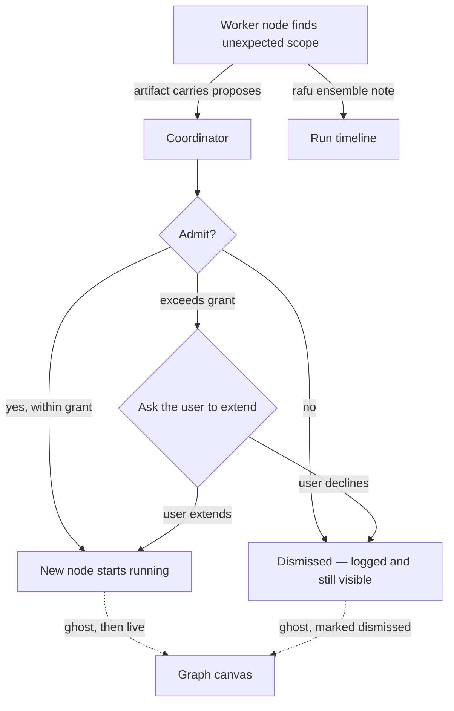

# C8 (candidate) — Coordinator UX: how Route B actually looks and feels

- **Status:** Design proposal (2026-07-25). Exploratory — no ADR amendment
  recorded, no branch, no owned paths assigned. Supersedes nothing.
- **Follows:** [`orchestration-gap-analysis.md`](orchestration-gap-analysis.md)
  (Route B recommendation, accepted by the user 2026-07-25)
- **Answers:** "I agree with Route B, but how does it come together in the
  Rafu UX? Where does a new user even start?"

## The question this document exists to answer

Route B settles the *architecture*: an external coordinator CLI has the loop
and the judgment; Rafu provides the substrate (worktrees, runs, gates) and
the cockpit (visibility, control, merge gates). What it does not settle is
the part the user actually touches.

Three open UX problems, in priority order:

1. **The cold-start problem.** Today the Ensemble's entry point is "author
   an agent file, then author a workflow file, then start a run." A new user
   does not know what an agent file is, what belongs in one, or how it
   relates to a workflow. This is the single biggest adoption risk in the
   whole feature.
2. **The comprehension problem.** Once several agents are running across
   worktrees, where does the user look to understand what is happening?
3. **The conversation problem.** The coordinator talks to child agents and
   waits on them. Where does that dialogue live, and how much of it is
   Rafu's business?

## Five design commitments

Everything below follows from these. They are stated up front because each
one closes off a plausible alternative, and the reasons matter more than
the conclusions.

### D1 — Rafu does not get a chat interface

The strongest temptation here is a native chat pane: pick your CLI from a
dropdown, type into a Rafu-styled message box. **Reject it.**

A chat pane means Rafu re-implements a conversation client per vendor,
tracks seven session formats, and — fatally — becomes the thing holding the
conversation. That is one small step from holding credentials, and ADR 0018
holds that Rafu embeds no agent and holds no inference keys. It also throws
away delegated auth, the feature's whole trust premise.

**The terminal tab is the chat interface.** Rafu already embeds SwiftTerm
(ADR 0004). When the user starts a coordinator, they get a real terminal
tab running the real `claude` or `codex` binary, with that vendor's real UI,
their real subscription, their real auth. The user types into it exactly as
they do today. Rafu's contribution is *everything around* that conversation:
the graph, the runs, the worktrees, the gates, the diffs.

This is not a compromise. It is why the feature can exist at all.

### D2 — Files stay the source of truth, but stop being the entry point

The cold-start problem is not solved by better documentation for agent
files. It is solved by making agent and workflow files an **output** of the
first run instead of a prerequisite for it.

The coordinator's first job, given a plain-language goal, is to write the
`.rafu/agents/*.md` and `.rafu/workflows/*.md` files it intends to use, and
show them to the user for approval. The user's first encounter with the file
format is reading a filled-in example about their own project, in Rafu's own
editor, with a gate asking "start this?" — not a blank file and a spec.

Files remain canonical, diffable, and hand-editable (C0's contract, C6's
scope resolution). They are simply no longer the thing standing between a
new user and their first run.

### D3 — The graph canvas is a projection, not an authoring tool

The run graph is rendered *from the manifest*, which is already the durable
truth (C0/C7). It is read-mostly: it shows state and hosts gate verbs. It is
not a drag-and-drop workflow builder.

Building a visual DAG editor would mean the graph becomes a second source of
truth competing with the files, which D2 exists to prevent. Editing a
workflow stays what it already is — text editing, in a tab.

### D4 — Transcripts come from Rafu's own capture, not session-file scraping

Reading `~/.claude/projects/**.jsonl`, Codex's session store, and five other
vendors' internal formats is tempting because the data is right there. It is
also undocumented, unstable across releases, and different for every vendor
— seven parsers that silently rot.

Rafu already captures every byte a child agent emits: C1's
`ConductorRunOutputCapture` tees the PTY into `.rafu/runs/<id>/`. That is a
format we own, that works identically for all seven CLIs, and that already
survives relaunch.

Session IDs are still worth capturing — as an opaque string in the manifest
powering one best-effort affordance, **"Resume in CLI"**, which hands the id
back to the vendor's own `--resume`. Best-effort, never load-bearing, and it
degrades to a disabled menu item rather than a broken pane.

### D5 — Hub-and-spoke in v1, not mesh

The user's instinct — *"a node would know when to push for another node,
that's why it's a graph"* — describes a mesh, where any node can spawn its
successors. That is the correct long-term shape and it is what makes the
topology genuinely a graph rather than a tree.

**Ship hub-and-spoke first anyway.** Only the coordinator spawns runs.
Children report upward and may *propose* successors; the coordinator decides
whether to admit them.

Three reasons, all of which get worse rather than better with scale:

- **The budget stays enforceable.** A single spawner means one place to
  count against the user's grant. In a mesh, any node can spawn, and a
  runaway graph is a runaway bill on the user's own subscription.
- **The graph stays comprehensible.** One decider means one narrative the
  user can follow. Mesh graphs are legible in diagrams and bewildering in
  practice at 3am.
- **The blast radius stays bounded.** This is a new trust surface. Start it
  as small as it can be while still being useful.

Growth path, deliberately cheap: a child already returns a structured
artifact. Let that artifact carry a `proposes:` block. The coordinator
admits or rejects. The user sees proposed-but-unadmitted nodes as ghosts on
the canvas. When that has run for a while and the budget accounting has
proven itself, admission can be delegated. Nothing about hub-and-spoke
forecloses the mesh — it just refuses to start there.

## Layer map

Who owns what. The dashed boundary is the trust line: nothing to its right
ever holds an inference credential.

The important asymmetry: **the coordinator can request, the user approves.**
Every arrow that mutates the user's repository passes through `U`.

## Solving the cold-start problem

### Three doors, one default

`⌘⇧E` / "New Ensemble…" opens one sheet with three doors. The guided door
is preselected and is the only one a new user needs.

Read that guided column as the answer to *"I won't know what an agent is."*
The user never authors one. They describe a goal, and their first sight of
the format is a populated file about their own repository sitting at a gate
that asks whether to proceed. **The format teaches itself by example, in
context, at the moment it becomes relevant.**

### The plan gate

This is the one slice of Route A the gap analysis recommended adopting, and
it is what makes the guided door a single run instead of two.

A plan-gate step's artifact *is* a set of workflow + agent files. The engine
parses them, renders the proposed graph, and parks at a human gate. Three
verbs, mirroring the existing gate vocabulary:

- **Approve** — the parsed steps are admitted into this run
- **Revise** — send a note back; the coordinator rewrites and re-gates
- **Edit** — open the files as ordinary tabs, edit by hand, re-check

Two properties make this safe: the graph is previewed **before** anything
spawns, and the files are on disk and hand-editable at the moment of
decision. Nothing is hidden inside a model's context.

## Solving the comprehension problem

### Canvas anatomy

The graph canvas is a new editor-canvas mode, alongside C5's run detail
canvas (`session.conductorRunCanvasID` already routes exactly this way, so
this is an additional branch, not new plumbing).

The window keeps ADR 0002's shape: the activity strip gains an **Ensemble**
item beside Files / Search / Source Control; the graph occupies the editor
canvas; terminal tabs sit below. What the canvas draws is the run DAG:

Node vocabulary, obeying the AGENTS.md rule that state is never carried by
color alone — every state has a distinct glyph *and* a text label:

| Glyph | State | Verbs on the node |
|---|---|---|
| `○` | Pending | — |
| `●` | Running | Open terminal · Open worktree · Abort |
| `⏸` | Blocked on dependency | Show what it's waiting for |
| `◇` | **Awaiting human gate** | Approve · Revise · Abort |
| `✓` | Complete | Open artifact · Open evidence |
| `⚠` | Interrupted (C7 recovery) | Retry · Abort · Keep worktree |
| `✕` | Failed | Open evidence · Retry |
| `⋯` | Proposed, not admitted (D5) | Admit · Dismiss |

Clicking a node focuses its terminal tab. That single interaction is what
makes the graph a navigation surface rather than a decoration — the graph
answers *what is happening*, one click answers *what is it saying right now*.

### Node lifecycle

Drawn as a flowchart rather than a `stateDiagram`, because the native preview
supports flowcharts and sequence diagrams only:

### Where conversation lives

Three surfaces, deliberately separated by *how much the user needs right
now* — this is the answer to "where do I look?":

| Surface | Content | Cost to read |
|---|---|---|
| **Graph canvas** | State, topology, gates | A glance |
| **Runs panel** | Chronological event log across all runs | A scan |
| **Terminal tab** | The live vendor UI, verbatim | Full attention |

Plus one durable layer under all of it: `.rafu/runs/<id>/` holds captured
output and artifacts, survives relaunch and quit, and is plain text on disk.

## Solving the conversation problem

### The coordinator's tools

`rafu ensemble <verb>` rides the existing uid-authenticated socket
(ADR 0009). Verbs are deliberately few:

| Verb | Purpose | Trust note |
|---|---|---|
| `run <workflow> [--role k=v]` | Start a child run | Counts against grant |
| `status [--run id] [--json]` | Poll runs, steps, artifact paths | Read-only |
| `await <run> --state <s>` | Block until a state is reached | Read-only |
| `artifact <run> <step>` | Read a handoff by path | Read-only |
| `propose-merge <run>` | Surface a diff to the human gate | **Never applies** |
| `note <run> <text>` | Post a line to the run timeline | Bounded length |

**One implementation caveat, load-bearing:** the current IPC contract began
as one frame per connection, strictly request/response
(`docs/references/cli-app-ipc.md`). `await` is therefore *not* free — it
requires either client-side polling over repeated `status` connections or a
new long-lived streaming frame kind. **Resolved (2026-07-26): streaming.**
The ADR 0018 amendment adds a long-lived subscription connection with framed
events, heartbeats, and bounded buffers while preserving one-frame
request/response connections for one-shot verbs.

### The loop, end to end

Read the `alt` block carefully — that is capability 5 from the gap analysis
("loop until done"), and note that **Rafu contributes nothing to it.** The
decision to loop is the coordinator's judgment, in its own context. Rafu's
engine still never decides. ADR 0018 holds.

### Two-way, within limits

Children are not mute. A worker can call `rafu ensemble note` to post to the
timeline, and its artifact may carry a `proposes:` block. What it cannot do
is spawn a sibling — that is D5, and it is what keeps the budget countable.

Dismissed proposals staying visible matters: the user can see what the
coordinator chose *not* to do, which is often the more interesting half of
its judgment.

## The consent model

The grant is set once, at the plan gate, in the same sheet as the goal:

- **Max concurrent child runs** (default 3, matching C6's per-window cap)
- **Allowed CLIs/roles** — a coordinator cannot reach for a vendor the user
  did not authorize
- **Usage ceiling** — best-effort, powered by C7's per-step deltas, honest
  about providers that report nothing
- **Wall-clock ceiling** — the backstop that works even when metering does not

On exhaustion the run **parks at a gate** and asks. It does not fail, and it
does not silently continue. Every child run is labeled `started by run <id>`
in the panel — no run in Rafu is ever unattributed.

## What this needs that does not exist yet

Honest dependency list. The prerequisite handoffs are closed; the remaining
rows describe C8 work governed by the approved execution plan.

| Need | Status |
|---|---|
| Concurrent runs driven from the GUI | **Closed (landed `2da406e`+`5e2ac85`)** — the fan-out substrate is on `main` |
| Usage persisted to the manifest | **Closed (landed `2da406e`+`5e2ac85`)** — usage ceilings can follow C7's honesty rule |
| Recovery verbs wired | **Closed (landed `2da406e`+`5e2ac85`)** — interrupted runs have explicit recovery |
| `rafu ensemble` verb surface | New — CLI + IPC request kinds |
| `await` semantics on a one-frame socket | **Decided: streaming** — see the ADR 0018 amendment |
| Plan-gate step kind | New — grammar + parse + preview + gate |
| Graph canvas | New — largest UI piece; additive canvas mode |
| `proposes:` in artifacts | New — small additive schema |
| Published coordinator skill | New — ships outside the app |
| ADR 0018 consent amendment | **Landed 2026-07-26** (C8-01) — mutating code is now unblocked |

The three C6/C7 prerequisites are satisfied on `main`; no substrate handoff
blocks the approved C8 execution plan.

## Open questions

1. **Where does the coordinator run?** In the user's repo (sees everything,
   can dirty the tree) or its own read-only worktree (clean, but cannot see
   uncommitted work)? Leaning coordinator-in-repo-read-only, workers in
   worktrees — but this is unresolved and affects the trust model.
   **Answered (2026-07-26):** The coordinator runs interactively in the
   user's checkout, with no coordinator worktree or manifest in v1. Child
   manifests preserve durable attribution through `startedBy`.
2. **`await` transport** — polling vs. a streaming frame kind. Polling is
   the honest v1; confirm before implementation.
   **Answered (2026-07-26):** Streaming. A long-lived subscription connection
   carries framed events with heartbeats; one-shot verbs retain the
   request/response contract. See the ADR 0018 amendment.
3. **Does the graph canvas span runs or show one?** C6 allows concurrent
   independent runs; a coordinator makes them related. Probably one canvas
   per coordinator tree, but the manifest has no parent link today.
   **Answered (2026-07-26):** One graph canvas per workspace groups related
   runs into coordinator trees through the new `startedBy` manifest field.
4. **Skill distribution** — bundled in the app and installed on demand, or
   published to a marketplace? Affects versioning against `rafu` CLI verbs.
   **Answered (2026-07-26):** Bundle the skill pack in the app and install it
   on demand from Settings → Ensemble.
5. **Nested coordinators** — a child coordinator spawning its own children.
   Recommend forbidding in v1; the budget math stops being tractable.
   **Answered (2026-07-26):** Forbidden structurally in v1. Only coordinator
   sessions receive `RAFU_ENSEMBLE_TOKEN`; worker children never receive it
   and may propose successors but cannot spawn them.

## Related

- [`orchestration-gap-analysis.md`](orchestration-gap-analysis.md) — the
  Route A/B analysis this builds on
- ADR 0018 — parent decision; needs a consent amendment before C8 code
- ADR 0009 / [`../../../references/cli-app-ipc.md`](../../../references/cli-app-ipc.md) — the socket the verbs ride
- ADR 0002 — activity strip and editor-hosted diffs; the canvas obeys it
- ADR 0004 — embedded terminal; the reason D1 is possible
- [`README.md`](README.md) — phase status and the five open handoffs
- C6 (concurrent runs), C7 (usage, recovery) — prerequisite substrate
