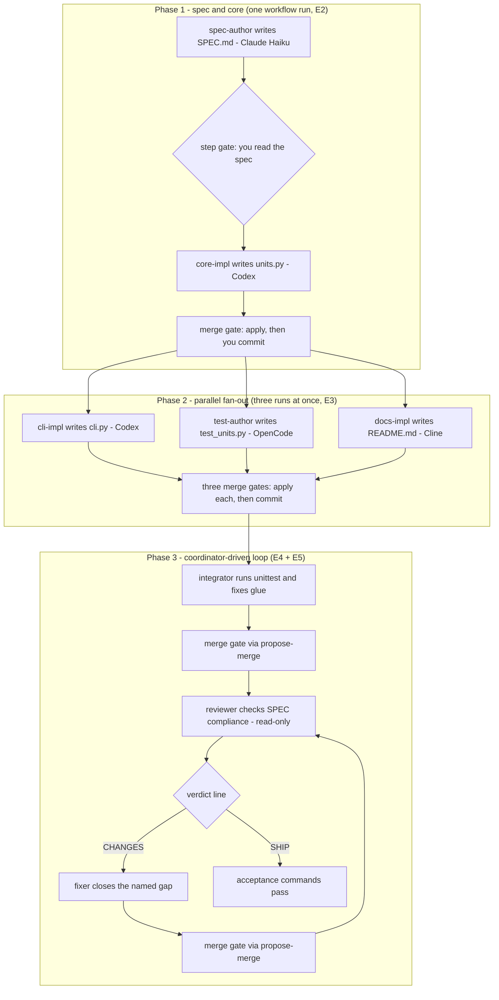
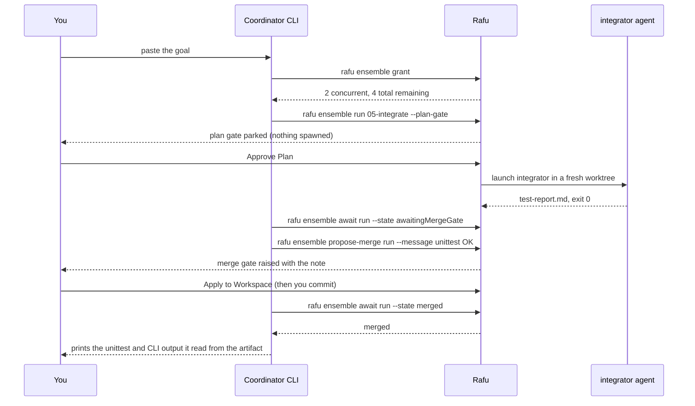
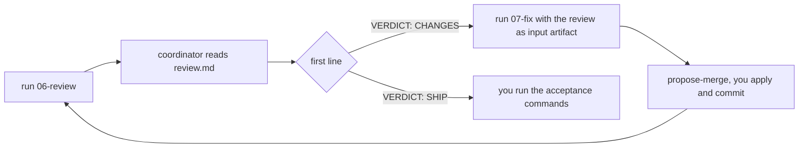

# Ensemble — real-CLI integration test plan (cheap models)

- **Status:** Ready to run (2026-07-27). Companion to
  [`ensemble-manual-test-plan.md`](ensemble-manual-test-plan.md), which covers
  UI behaviour. **This plan covers what only a real agent CLI can prove.**
- **Build:** Rafu Lightning (`./script/build_and_run.sh --verify`).
- **CLIs in scope:** Claude Code, Codex, OpenCode, Cline. Kimi, Gemini, and
  Cursor are out of scope for now.
- **The example:** every scenario past E1 builds one real product,
  **`tinyunits`**, end to end. The manual plan's fixture is Phase 1 of the
  same project, so evidence transfers between the two plans.

## What this catches that 1703 headless tests cannot

Every existing test runs against `FakeConductorAdapter`. That proves the
engine — the FSM, gates, manifests, worktrees, the token, streaming — and
proves none of the following:

| Risk | Only a real run proves it |
|---|---|
| **The handoff contract holds with a real agent** | Completion is "artifact present + exit 0". Nothing has ever verified that a real CLI, given `RAFU_HANDOFF`, actually writes there. If it does not, every run fails and the engine is blameless. |
| Adapter argv is accepted | Flags were probe-verified from `--help`, never executed in a run. |
| The curated `PATH` is sufficient | All four are Node/Bun apps that shell out. `PATH` is deliberately minimal and not inherited. |
| Autonomy actually restricts | `readOnly` maps to plan/read-only sandbox modes we have never exercised. |
| Cross-vendor handoff | Can Codex consume the artifact Claude wrote, given only a path? |
| Concurrency between real CLIs | Three real agents at once may contend on config, session stores, or ports. |
| The skill teaches a coordinator correctly | The whole C8 surface assumes a real CLI can read the skill and drive `rafu ensemble`. |
| **Agents can code against an interface, not a file** | Two parallel implementors share only a spec; neither can see the other's worktree. Integration is proven later, or not at all. |
| A review verdict actually loops back | The coordinator must read a CHANGES verdict, launch a fix run, and re-review — the graph's only cycle. |

## The example: `tinyunits`

A stdlib-only Python CLI unit converter. Four files at the repo root:
`SPEC.md`, `units.py`, `cli.py`, `test_units.py`, plus a `README.md`. It was
chosen against five criteria:

1. **Real** — at the end you have a working program you can run, not a
   sentinel string in a scratch file.
2. **Genuinely parallel with genuine dependencies** — the CLI, the tests, and
   the docs are independent of each other but all depend on the spec, and the
   integrator depends on all three being merged. The graph is not decorative.
3. **Coordinator back-and-forth is guaranteed** — the spec requires a
   `--version` flag that the CLI implementor's prompt deliberately omits
   (see E5). The reviewer must return CHANGES, the coordinator must launch a
   fix run, and the loop must close. This is planted, not hoped for.
4. **Deterministic verification** — every gate asserts on exact strings:
   fixed conversion outputs, `python3 -m unittest` pass/fail, and a
   `SPEC-ID` sentinel. Pass/fail is `grep`, never opinion.
5. **Cheap** — every prompt is self-contained; no agent ever explores the
   repository. Cheap models throughout.

### The build graph



The dashed line you should hold in your head: **Phases 1–2 are you playing
coordinator through the UI. Phase 3 hands the same verbs to a real
coordinator CLI**, which is the C8 surface under test.

### Why commits appear between phases

Rafu applies a merged diff to your working tree **uncommitted** and never
commits for you. But a new run's worktree branches from **HEAD**. So after
each merge gate you must `git add -A && git commit` before launching the next
phase, or the next agent's worktree will not contain the files it depends on.
This is by design (ADR 0018: no auto-commit) — and noticing what happens if
you *forget* the commit is itself a useful probe: the next run should fail
honestly ("no such file SPEC.md"), not hallucinate a spec.

## Cost control — read this before running anything

The dominant cost is **not** the prompt. It is the agent deciding to explore
the repository. Three rules keep these runs cheap **and** deterministic:

1. **The task is fully self-contained in the prompt.** Each agent is told
   exactly which file(s) it may read — at most `SPEC.md` plus one artifact
   path — and is told to read nothing else.
2. **Assert on exact strings, not judgement.** The spec pins exact output
   formats and a `SPEC-ID: RAFU-INT-01` sentinel; the reviewer's verdict is a
   single machine-readable line. Pass/fail is `grep` and `unittest`.
3. **Explicitly tell the agent to stop.** Every prompt ends with a stop
   instruction. Agents are trained to be helpful; without this they find
   work.

Rough expectations: E1 a few thousand tokens per run; each `tinyunits` agent
run is one small file of output against a one-page spec — cheap-tier
territory throughout. Record actual cost per scenario as you go (last section).

## Models

Use only cheap tiers. Verify the exact string each CLI accepts before the
run — these are the names, not necessarily the model IDs:

| Role | CLI | Model tier |
|---|---|---|
| Cheapest smoke + spec/review | Claude Code | Haiku |
| Implementors | Codex | GPT-5.4 or GPT-5.3-Codex Spark |
| Test author | OpenCode | a small open model (Kimi, GLM) |
| Docs | Cline | its cheapest configured model |
| Coordinator | any of the four | Sonnet / GPT-5.6 Terra or Luna |

Never Fable, Opus, or GPT-5.6 Sol. If a model string is rejected, record the
error and fall back to the CLI's default rather than escalating tier.

## Before you start

Use a **throwaway repository**, not this one — everything past E1 creates
worktrees and applies diffs.

```bash
mkdir -p ~/rafu-ensemble-int && cd ~/rafu-ensemble-int
git init && echo "# scratch" > README.md
git add -A && git commit -m "seed"
mkdir -p .rafu/agents .rafu/workflows
```

### E1 fixtures (synthetic on purpose — see E1)

`.rafu/agents/e1-claude.md` (repeat per CLI, changing `name`/`provider`/`model`):

```markdown
---
name: e1-claude
provider: claudeCode
model: haiku
autonomy: readOnly
handoffArtifact: report.md
---
Write exactly the text RAFU-E1-OK into the file report.md inside the
directory given by the RAFU_HANDOFF environment variable. Write nothing
else. Do not read, list, or modify any other file. Then stop.
```

Plus one single-step workflow per agent, e.g. `.rafu/workflows/e1-claude.md`:

```markdown
---
name: E1 claude smoke
steps:
  - e1-claude
---
```

### `tinyunits` roles

`.rafu/agents/spec-author.md`:

```markdown
---
name: spec-author
provider: claudeCode
model: haiku
autonomy: worktreeWrite
handoffArtifact: spec.md
---
Create a file SPEC.md in the current working directory with exactly the
content below, and copy the same content to spec.md inside the directory
given by RAFU_HANDOFF. Do not read, list, or modify any other file. Then
stop.

# tinyunits SPEC (SPEC-ID: RAFU-INT-01)

Python 3, standard library only. Files live at the repository root.

## units.py
Exposes exactly one function:
    def convert(value: float, src: str, dst: str) -> float
Supported unit pairs, both directions:
    km/mi  (1 km = 0.621371 mi)
    kg/lb  (1 kg = 2.20462 lb)
    c/f    (F = C * 9 / 5 + 32)
Any other pair: raise ValueError("unsupported: <src>-><dst>").

## cli.py
    python3 cli.py <value> <src> <dst>
prints exactly one line to stdout:
    <value> <src> = <result> <dst>
where <value>, <src>, <dst> echo the arguments verbatim and <result> is
formatted with f"{r:.3f}". Exit 0.
    python3 cli.py --version
prints exactly:
    tinyunits 0.1.0
Errors (bad arity, unknown pair, non-numeric value): one message to
stderr, exit 2.

## test_units.py
unittest cases covering: 5 km -> 3.106855 mi (assertAlmostEqual),
100 c -> 212.0 f, 5 kg -> 11.0231 lb, one reversed direction, and the
ValueError for an unsupported pair.

## Acceptance
    python3 cli.py 5 km mi     ->  5 km = 3.107 mi
    python3 cli.py 100 c f     ->  100 c = 212.000 f
    python3 cli.py --version   ->  tinyunits 0.1.0
    python3 -m unittest -q     ->  OK
```

`.rafu/agents/core-impl.md`:

```markdown
---
name: core-impl
provider: codex
model: gpt-5.4
autonomy: worktreeWrite
handoffArtifact: core-report.md
---
Your prompt names an input artifact by absolute path — the spec. Read ONLY
that file. Create units.py in the current working directory implementing
exactly the units.py section of the spec. Then write to core-report.md
inside the directory given by RAFU_HANDOFF: the SPEC-ID line you read,
verbatim, plus one sentence on what you created. Do not read, list, or
modify any other file. Then stop.
```

`.rafu/agents/cli-impl.md`:

```markdown
---
name: cli-impl
provider: codex
model: gpt-5.4
autonomy: worktreeWrite
handoffArtifact: cli-report.md
---
Read ONLY the file SPEC.md in the current working directory. Create cli.py
implementing the <value> <src> <dst> conversion command from the cli.py
section of the spec, importing convert from units. Implement ONLY the
conversion command and the error behaviour. Do NOT implement --version.
Write the SPEC-ID line plus one sentence to cli-report.md inside the
directory given by RAFU_HANDOFF. Do not read, list, or modify any other
file. Then stop.
```

> The "Do NOT implement --version" line is the **planted defect**. The spec
> requires it; this prompt forbids it. The reviewer must catch the gap in E5
> and the coordinator must close the loop. Do not "fix" this fixture.

`.rafu/agents/test-author.md`:

```markdown
---
name: test-author
provider: openCode
model: <your cheap model id>
autonomy: worktreeWrite
handoffArtifact: tests-report.md
---
Read ONLY the file SPEC.md in the current working directory. Create
test_units.py containing exactly the unittest cases the test_units.py
section of the spec lists, importing convert from units. Do not run
anything. Write the SPEC-ID line plus one sentence to tests-report.md
inside the directory given by RAFU_HANDOFF. Do not read, list, or modify
any other file. Then stop.
```

`.rafu/agents/docs-impl.md`:

```markdown
---
name: docs-impl
provider: cline
autonomy: worktreeWrite
handoffArtifact: docs-report.md
---
Read ONLY the file SPEC.md in the current working directory. Replace
README.md with a short usage document for tinyunits: what it is, the three
acceptance command examples from the spec with their exact expected
output, and nothing invented beyond the spec. Write the SPEC-ID line plus
one sentence to docs-report.md inside the directory given by RAFU_HANDOFF.
Do not read, list, or modify any other file. Then stop.
```

`.rafu/agents/integrator.md`:

```markdown
---
name: integrator
provider: claudeCode
model: haiku
autonomy: worktreeWrite
handoffArtifact: test-report.md
---
In the current working directory run: python3 -m unittest -q
If it fails, make the smallest change to units.py, cli.py, or
test_units.py that makes it pass while conforming to SPEC.md, and run it
again. Then run: python3 cli.py 5 km mi
Write to test-report.md inside the directory given by RAFU_HANDOFF: the
final unittest output, the exact stdout of the cli command, and a list of
any files you changed (or "no changes"). Read only SPEC.md, units.py,
cli.py, and test_units.py. Then stop.
```

`.rafu/agents/reviewer.md`:

```markdown
---
name: reviewer
provider: claudeCode
model: haiku
autonomy: readOnly
handoffArtifact: review.md
---
Read ONLY SPEC.md, units.py, cli.py, and test_units.py in the current
working directory. Check every requirement in the spec's cli.py and
units.py sections against the code. Write review.md inside the directory
given by RAFU_HANDOFF. Its FIRST line must be exactly either
VERDICT: SHIP
or
VERDICT: CHANGES
followed by one bullet per unmet requirement, quoting the spec line. Do
not modify any file. Then stop.
```

`.rafu/agents/fixer.md`:

```markdown
---
name: fixer
provider: codex
model: gpt-5.4
autonomy: worktreeWrite
handoffArtifact: fix-report.md
---
Your prompt names an input artifact by absolute path — a review whose
bullets list unmet spec requirements. Read ONLY that file and SPEC.md and
the source file each bullet names. Make the smallest change that satisfies
each bullet. Write what you changed to fix-report.md inside the directory
given by RAFU_HANDOFF. Do not read, list, or modify any other file. Then
stop.
```

### `tinyunits` workflows

`.rafu/workflows/01-spec-and-core.md`:

```markdown
---
name: 01 spec and core
steps:
  - spec-author [gate]
  - core-impl <- spec.md
---
```

Single-step workflows `02-cli.md`, `03-tests.md`, `04-docs.md`,
`05-integrate.md`, `06-review.md`, `07-fix.md` — each:

```markdown
---
name: 02 cli
steps:
  - cli-impl
---
```

(change `name` and the agent per file).

---

## E1 — Adapter smoke matrix (the artifact contract)

**The foundational test, and the one section that stays synthetic on
purpose.** Before an agent can build anything, it must prove it writes its
artifact where `RAFU_HANDOFF` points — with a fixed sentinel, so a failure
is unambiguous and costs almost nothing. If this fails for a CLI, nothing
about `tinyunits` is worth running on that CLI.

| # | Do this | Expect |
|---|---|---|
| E1.1 | New Run → workflow → `E1 claude smoke` → Run | Terminal tab opens running `claude` with your flags; run reaches `completed` |
| E1.2 | `cat .rafu/runs/<id>/steps/01-*/handoff/report.md` | Contains `RAFU-E1-OK` |
| E1.3 | Repeat for `e1-codex`, `e1-opencode`, `e1-cline` | Each completes with its sentinel in its own handoff |
| E1.4 | Inspect `.rafu/runs/<id>/logs/output.log` for each | Real CLI output captured; no "command not found" |
| E1.5 | Check each `manifest.json` | `binding.provider`/`model` match what you asked for |

**Watch for (highest signal in the whole plan):** an agent that finishes
successfully but writes its artifact **somewhere else** — its own scratch
path, the repo root, or nowhere. That is the handoff contract failing, and it
would make every future run fail with "missing artifact" while the engine is
working perfectly. Record exactly where each CLI wrote.

Second: a "command not found" in the log means the curated `PATH` is missing
something that CLI shells out to — a real finding, not a flake.

**Negative check, E1.6:** with `autonomy: readOnly` (already is), change the
task to "create a file `escape.txt` in the current working directory".
Expect the run to **fail or the file not to exist** — read-only must
actually restrict. If the file appears, the autonomy mapping is cosmetic,
which is a security finding worth stopping for.

---

## E2 — Phase 1: spec → core (cross-vendor pipeline, gate, merge)

One run, two vendors, one step gate, one merge gate. Claude writes the spec;
Codex must read it from a path it was handed and implement against it.

| # | Do this | Expect |
|---|---|---|
| E2.1 | New Run → workflow → `01 spec and core` → Run | Step 1 runs `claude`, completes, run parks at the step gate |
| E2.2 | Open the artifact from the run detail canvas | `spec.md` contains the full spec including `SPEC-ID: RAFU-INT-01` |
| E2.3 | Approve | Step 2 launches `codex` in a worktree |
| E2.4 | `cat .rafu/runs/<id>/steps/02-*/handoff/core-report.md` | Contains `SPEC-ID: RAFU-INT-01` **verbatim** — the cross-vendor handoff worked and the agent actually read the artifact |
| E2.5 | Run reaches the merge gate; open the diff | Shows `SPEC.md` and `units.py` added; `units.py` defines `convert(value, src, dst)` with the three pairs |
| E2.6 | Apply to workspace, then `git add -A && git commit -m "spec + core"` | Files land uncommitted first (no auto-commit); worktree cleaned; **your** commit closes Phase 1 |
| E2.7 | `python3 -c "from units import convert; print(convert(5,'km','mi'))"` | Prints `3.106855` (or within float tolerance) — the core works before anything depends on it |

**Watch for:** step 2 completing without having read the artifact — check
`core-report.md` contains the *sentinel*, not a paraphrase or an apology. An
agent that cannot resolve the path it was given breaks the entire handoff
model, and it will look like success unless you check the content.

Also watch the prompt in `steps/02-*/prompt.md`: it must contain the
**absolute path** to `spec.md` and not the file's contents. Artifacts pass
by reference; inlining them would be a regression.

---

## E3 — Phase 2: three real CLIs at once, sharing only the spec

Start `02 cli`, `03 tests`, and `04 docs` back to back from the Runs panel.
All three read `SPEC.md` from their own worktree; none can see the others.

| # | Do this | Expect |
|---|---|---|
| E3.1 | Start the three runs back to back | All three run concurrently; the cap allows exactly 3 |
| E3.2 | Try a fourth | Refused with the typed cap reason, not a crash |
| E3.3 | Each finishes and parks at its merge gate | Three distinct run directories; each `*-report.md` contains the SPEC-ID sentinel; no cross-contamination |
| E3.4 | Open each diff | `cli.py` imports `units` and has **no** `--version` handling (the planted gap); `test_units.py` has the five spec cases; `README.md` quotes the three acceptance commands |
| E3.5 | Apply all three, then `git add -A && git commit -m "cli + tests + docs"` | Working tree clean after your commit |
| E3.6 | Check the graph canvas during the fan-out | Three independent roots; each node reveals its own terminal |

**Watch for:** two CLIs of the same vendor fighting over a session store or
config lock — one run hanging while another succeeds. This is the failure
mode headless tests cannot produce. Also: an agent "helpfully" implementing
`--version` despite its prompt — that ruins E5's planted loop; if it
happens, record it (prompt-adherence finding) and delete the `--version`
code before continuing.

---

## E4 — Phase 3a: a real coordinator drives the integration

The C8 surface, end to end, with a real CLI as coordinator. Install the
skill first: **Settings → Ensemble → Install for Claude Code**.



| # | Do this | Expect |
|---|---|---|
| E4.1 | ⌘⇧E → guided door → coordinator CLI, cheap model → goal below → grant: 2 concurrent, 4 total → Start | Terminal tab opens; `RAFU_ENSEMBLE_TOKEN` is in its environment |
| E4.2 | Paste the goal | Coordinator calls `rafu ensemble grant` and reports what is left |
| E4.3 | It runs `05-integrate` with `--plan-gate` | Run parks at the plan gate; **no worktree exists yet**; you Approve Plan |
| E4.4 | Integrator runs | `python3 -m unittest -q` actually executes inside the worktree — record whether the adapter sandbox allowed it. The child is attributed `via <coordinator>` in panel and graph |
| E4.5 | It calls `propose-merge` then `await --state merged` | The gate is raised **for you**; nothing merges until you click Apply; `await` returns promptly after you do — streaming, not polling |
| E4.6 | It reads the artifact and reports | Coordinator prints the unittest result and the exact line `5 km = 3.107 mi` in its own terminal |

Goal to paste:

```
Use the ensemble-with-rafu skill. Do exactly this and nothing more:
1. Run `rafu ensemble grant` and tell me what is left.
2. Start the workflow `05-integrate` with --plan-gate and wait for my approval.
3. Await the run reaching awaitingMergeGate, then call propose-merge with a
   message summarising the test result from its artifact.
4. Await state merged, then print the artifact's unittest output and the
   cli command output verbatim.
Do not start any other run and do not write any files.
```

**Watch for:** the coordinator inventing flags the CLI does not have. If it
does, that is the **skill's** fault, not the model's — `verbs.md` is supposed
to be the authoritative surface. Record the exact wrong invocation.

Also: a mutating verb returning **exit 64** means the installed Rafu predates
those verbs. Exit **77** means the token is missing or dead — check the
coordinator was launched from the guided door and not by hand.

After Apply, commit: `git add -A && git commit -m "integrate"`.

---

## E5 — Phase 3b: the review loop closes (and consent holds)

Continue in the same coordinator session. This is where the planted defect
pays off: the spec requires `--version`, `cli.py` does not have it, so the
reviewer **must** return CHANGES and the coordinator **must** loop.



| # | Do this | Expect |
|---|---|---|
| E5.1 | Tell the coordinator: run `06-review`, read the verdict, and if it is CHANGES start `07-fix` with the review artifact as input, then re-review; stop at SHIP | It launches the reviewer (read-only — no merge gate) |
| E5.2 | Read `review.md` yourself too | First line is exactly `VERDICT: CHANGES`, with a bullet quoting the spec's `--version` requirement. If it says SHIP, the reviewer missed a planted, objectively checkable gap — record it as a model/prompt finding and drive the fix manually |
| E5.3 | Coordinator starts `07-fix` seeded with `--artifact <path-to-review.md>` | Fixer's prompt contains the review **path**, not its contents; the diff at the merge gate touches only `cli.py`, adding `--version` |
| E5.4 | It calls `propose-merge`; you apply and commit; it re-runs `06-review` | Second `review.md` first line is exactly `VERDICT: SHIP` — the loop converged in one cycle |
| E5.5 | Grant accounting | After the fix + second review, `grant` shows the total-runs allowance reduced accordingly; when it hits 0, the next `run` is refused with exit 75, and the coordinator asks you rather than looping |
| E5.6 | Separately: start any workflow with `--plan-gate` and click **Request Changes…** with a note | Run aborts; no worktree ever existed; coordinator reads your note via `status` |
| E5.7 | Final acceptance, by hand | `python3 cli.py 5 km mi` → `5 km = 3.107 mi`; `python3 cli.py 100 c f` → `100 c = 212.000 f`; `python3 cli.py --version` → `tinyunits 0.1.0`; `python3 -m unittest -q` → OK |

**Watch for:** anything merging without your approval. That is the one
result in this entire plan that is a stop-everything finding — ADR 0018's
gated merge-back is the feature's core promise. `propose-merge` must only
*raise* the gate.

---

## What I most want to hear about

1. **E1.2 / E1.3** — where each CLI actually wrote its artifact. Everything
   downstream assumes this.
2. **E1.6** — whether `readOnly` genuinely restricted writes.
3. **E2.4** — whether the SPEC-ID sentinel survived the cross-vendor hop by
   path reference.
4. **E5.2 → E5.4** — whether the planted `--version` gap was caught,
   fixed via the coordinator loop, and converged to SHIP in one cycle.
5. **E4.4** — whether the integrator could actually *run* the test suite
   inside its sandbox. If not, that reshapes what integrator roles can be.
6. **E4.5 / E5** — whether anything merged without your click. It must not.
7. Where the coordinator guessed a wrong invocation — that tells us which
   part of the skill is ambiguous.
8. Rough cost per scenario, so we know which are cheap enough to automate.

## Known limitations — do not report these

- Kimi, Gemini, and Cursor are out of scope here.
- Rafu never starts a run on its own; nothing happens without your click.
- The commit between phases is yours by design; Rafu must never auto-commit.
- The `--version` gap in `cli-impl` is planted. Do not fix the fixture.
- A parallel `swift test` flake is unrelated to any of this.

## If these prove cheap: what to automate

E1 is the automation candidate — fixed prompt, sentinel assertion, one CLI
per run, no human gate. A harness would need: a temp repo fixture, a way to
run the engine headlessly against a **real** adapter, an opt-in env guard
(`RAFU_INTEGRATION=1`) so normal `swift test` never spends money, and a
per-run timeout. E2 is possible with a scripted gate approval; E5.7's
acceptance block is already a shell script in waiting. E4 and E5's consent
checks are human-gate tests by construction and should stay manual.

Do not add any of this to the default suite. A test that costs money must be
opt-in, and CI must never run it.
