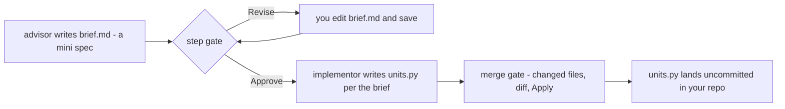
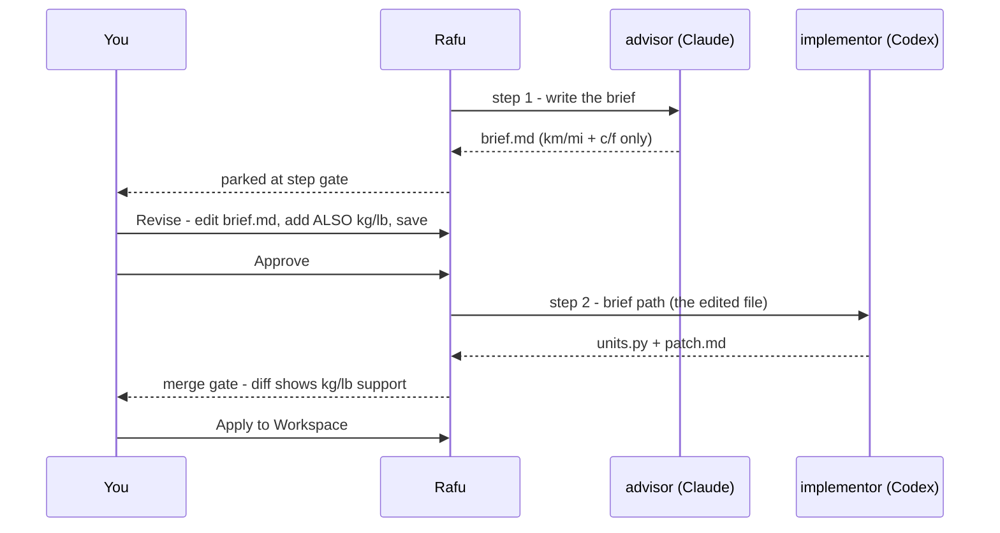

# Ensemble — manual test plan (C0–C8 + the five integration handoffs)

- **Status:** Ready to run (2026-07-25). Everything below is headless-verified;
  this document covers only what a human must see with their own eyes.
- **Build:** `./script/build_and_run.sh --verify` from a clean `main`.
- **How to report back:** for each check write **PASS**, **FAIL**, or **N/A**,
  plus what you actually saw. A one-line "expected X, saw Y" is enough — I do
  not need screenshots unless something looks visually wrong.
- **Fixture:** the roles below are **Phase 1 of `tinyunits`**, the real
  unit-converter CLI that
  [`ensemble-integration-test-plan.md`](ensemble-integration-test-plan.md)
  builds end to end with a full agent graph. Run this plan first; the
  integration plan picks up the same project where this one stops.

## Before you start (5 minutes)

You need a **throwaway git repo** — these tests create worktrees and commits.

```bash
mkdir -p ~/rafu-ensemble-test && cd ~/rafu-ensemble-test
git init && echo "# scratch" > README.md
git add . && git commit -m "initial"
```

Then create role and workflow files. In Rafu, open `~/rafu-ensemble-test`,
and create these five files (the Ensemble reads plain Markdown — you can
create them in Rafu's editor or in a terminal).

The fixture is **Phase 1 of the `tinyunits` example** — the same tiny
unit-converter CLI the integration plan
([`ensemble-integration-test-plan.md`](ensemble-integration-test-plan.md))
builds end to end. Here the advisor writes a real (small) spec and the
implementor writes real (small) code, so the Revise flow in section D edits
something that visibly changes the output — instead of a toy sentence.



`.rafu/agents/advisor.md`
```markdown
---
name: advisor
provider: claudeCode
autonomy: readOnly
handoffArtifact: brief.md
---
Write an implementation brief to brief.md inside the directory given by
RAFU_HANDOFF, and nothing else. The brief must specify a single file
units.py at the repository root exposing exactly
convert(value, src, dst) supporting km<->mi (1 km = 0.621371 mi) and
c<->f (F = C * 9 / 5 + 32), raising ValueError for any other pair. Include
one worked example: convert(5, "km", "mi") == 3.106855. Do not read, list,
or modify any repository file. Then stop.
```

`.rafu/agents/implementor.md`
```markdown
---
name: implementor
provider: codex
autonomy: worktreeWrite
handoffArtifact: patch.md
---
Your prompt names an input artifact by absolute path — the brief. Read
ONLY that file. Create units.py in the current working directory
implementing exactly what the brief specifies, including any lines the
brief adds after the word ALSO. Summarise what you built in patch.md
inside the directory given by RAFU_HANDOFF. Do not read, list, or modify
any other file. Then stop.
```

`.rafu/workflows/advise-implement.md`
```markdown
---
name: Advise then implement
steps:
  - advisor [gate]
  - implementor <- brief.md
---
```

`.rafu/workflows/remote-ok.md` (for the remote-approval test)
```markdown
---
name: Remote approvable
steps:
  - advisor [gate:remote]
---
```

> **Note:** Claude Code, Codex, OpenCode, Cline, and Cursor have
> runtime-verified adapter surfaces on this Mac. Gemini is installed but its
> Ensemble adapter runtime remains unverified. If a run fails immediately with
> "agent adapter is unavailable", check **Settings → Agents** first (test A1).

---

## A. Settings and discovery

| # | Do this | Expect |
|---|---|---|
| A1 | Open **Settings → Agents** | Seven rows: Claude Code, Codex, OpenCode, Cline, Kimi CLI, Gemini CLI, Cursor CLI. Each shows an install status and a sign-in status. On this Mac: Claude Code, Codex, OpenCode, **Cline** (nvm install), **Gemini** (nvm install), and Cursor CLI should read as FOUND; only Kimi should read not found. Cursor should read signed in. Gemini's sign-in status may remain unknown until its adapter runtime is separately verified. |
| A1b | Compare each row against `which <cli>` in a terminal | They must agree. A CLI that resolves in your shell but reads "Not found" in Rafu is the launchd-PATH bug (fixed 2026-07-25, see `docs/references/gui-app-path-and-cli-discovery.md`) — report it with the output of `which <cli>`. |
| A2 | Read the footer text under the rows | It says Rafu runs your existing CLIs under your own subscriptions and never stores a sign-in token. |
| A3 | Open a model picker on Claude Code | Model choices appear, plus a way to type a custom id. Nothing here should claim a model exists that you know does not. |
| A4 | Open **Settings → Ensemble** | The `ensemble-with-rafu` coordinator skill card renders. Its line says **Skill 1 • Rafu 1** with no mismatch warning; a mismatch must show both a warning glyph and explanatory text. |
| A5 | Click **Install for Claude Code**, then repeat it; finally edit one installed file and click again | Five files land under `~/.claude/skills/ensemble-with-rafu/`, and the result line names that exact path. The second install is idempotent (0 written, 0 replaced, 5 skipped). After the edit, Rafu asks before replacing anything; Cancel preserves the edit and confirmed replacement reports the replaced count. |

**Watch for:** any row claiming a CLI is available that you know is not
installed. Honesty here is the whole point — a false positive is a bug.

---

## B. The Runs panel and workflow library (C5 + C6)

| # | Do this | Expect |
|---|---|---|
| B1 | Click the **Runs** icon in the left activity strip | The panel appears, header pinned to the TOP (not floating in the vertical middle), with an empty state saying Ensemble runs appear here once a run has been started. |
| B2 | Find the **Workflows** section/tab in that panel | Your two workflow files are listed, labelled with their scope (repository). |
| B3 | Use **New from Template** | The three bundled templates are offered (advise-implement-document, review-only, implement-review). Pick one; it lands in `.rafu/workflows/` and appears in the list. |
| B4 | Run **New from Template** again with the same template | It asks before replacing — it must NOT silently overwrite. |
| B5 | Click **Open** on a workflow | It opens as an ordinary editor tab you can edit. Not a modal, not a special editor. |
| B6 | Click **Reveal in Finder** | Finder opens at the file. |
| B7 | Break a workflow file on purpose (e.g. change `- advisor` to `- nobody`), save, return to the panel | The error is shown **inline in the list**, never as a modal dialog. Fix it before continuing. |

**Watch for (known-risk):** B1's top-pinning. If the header drifts to the
middle when the list is short, that is the recurring AGENTS.md alignment bug.

---

## C. A single-role run end to end (C1)

| # | Do this | Expect |
|---|---|---|
| C1 | **New Run…** → choose Single role → advisor → task "Write the units brief" → Run | A terminal tab opens showing the real Claude Code CLI working. The tab is badged with the role name. |
| C2 | Watch the Runs panel while it runs | The run appears under **Active** with a status symbol AND a text label — never colour alone. |
| C3 | Let it finish | The run parks. Because advisor is `readOnly`, there should be **no** merge gate — it completes. |
| C4 | Click the run in the panel | The run timeline canvas opens as an editor tab: role name, provider/model chips, status, duration. |
| C5 | Click **Open Artifact** on the completed step | `brief.md` opens as a normal editor tab containing the actual mini spec — `convert(value, src, dst)`, the two unit pairs, and the worked example. |
| C6 | Check `.rafu/runs/<id>/` in the file tree | You see `prompt.md`, `handoff/brief.md`, and `logs/output.log`. **Open `output.log`** — it should contain the raw terminal output of the run (with escape codes; it is a transcript, not clean text). |

**Watch for:** C6's `output.log` being empty. That is handoff-era work (the
PTY tee) and the single most likely thing to be silently broken.

---

## D. A gated pipeline, and the Revise flow (C5)

This is the flagship path — the one that makes Ensemble worth building. The
key assertion is D7: your **edited** brief, not the original, is what flows
to the implementor — and because the brief is a real spec here, the proof is
a line of code, not a leap of faith.



| # | Do this | Expect |
|---|---|---|
| D1 | **New Run…** → **Workflow** mode → "Advise then implement" | The picker shows the resolved steps: advisor (Claude Code) → implementor (Codex), with the gate marked. |
| D2 | Optionally override implementor's model in the sheet | The override is accepted without editing the file. |
| D3 | Run it | Step 1 (advisor, Claude) runs in a terminal tab. |
| D4 | When step 1 finishes | The run **parks at the gate**. Step 2 must NOT have started. The timeline shows Approve / Revise / Abort as visible buttons with text labels. |
| D5 | You should get a notification / notch signal | A gate-ready signal appears with the workflow and role name — and **nothing else** (no artifact text, no captured output). Its only action should be **Open Run** (not Approve — this workflow uses a plain `[gate]`). |
| D6 | Click **Revise** | `brief.md` opens as an editor tab. **Edit it meaningfully**: add the line `ALSO: also support kg<->lb (1 kg = 2.20462 lb).` Save it. |
| D7 | Click **Approve** | Step 2 (implementor, Codex) starts, and it should act on your EDITED brief. The check is objective: the resulting `units.py` must handle kg/lb — grep the diff for `2.20462`. If it only has km/mi and c/f, the original brief flowed forward and the Revise flow is broken. |
| D8 | Let step 2 finish | The run parks at the **merge gate** (implementor is `worktreeWrite`), showing `units.py` in the changed-file list. |
| D9 | Click the changed file | It opens in the diff canvas; the kg/lb branch is visible in the diff. |
| D10 | Click **Apply to Workspace** | `units.py` is applied to your working tree. `git status` shows it **uncommitted** — Rafu must never auto-commit. The run's worktree is removed. Optional smoke: `python3 -c "from units import convert; print(convert(5,'kg','lb'))"` prints ≈ `11.0231`. |
| D11 | Check the run timeline again | Both steps show completed, with durations. If your Codex/Claude usage is metered, you should see usage lines per step and a "Run usage" line in the header. |

**Watch for:**
- D7 is the single most important check in this document, and `2.20462` in
  the diff is its whole proof. If step 2 acts on the *original* brief rather
  than your edit, the Revise flow is broken.
- D11's usage lines: if a provider has no metering, showing **nothing** is
  correct. A "0%" would be the bug.

---

## E. Concurrency (C6 + handoff 1)

| # | Do this | Expect |
|---|---|---|
| E1 | Start a workflow run, and while it is running open **New Run…** again | It is **enabled** — C6 allows several runs at once. (Before handoff 1 this was disabled, which is what I fixed.) |
| E2 | Start a second run, then a third | All three appear under Active, each with its own terminal tab. |
| E3 | Try to start a fourth | It is refused with a readable message naming the 3-run limit — not a silent no-op. |
| E4 | With two runs parked at gates, select run A and click Approve | **Only run A advances.** Run B stays parked. This is the verb-routing fix; if approving A also advances B, that is a serious bug. |
| E5 | Check the two runs' worktrees (`.rafu-worktrees/`) | Each mutating run has its OWN worktree directory. Two runs must never share one. |
| E6 | Open the Ensemble menu (Rafu's menu bar) with run A selected | Approve Gate / Revise Gate Artifact / Abort Run / Retry Failed Step are present and correctly enabled/disabled for A's state. |
| E7 | Open the command palette (⌘⇧P) and type "gate" | The same verbs appear and act on the SELECTED run. |

**Watch for:** E4 and E7 both test the same fix from different entry points.
If either acts on the wrong run, tell me which one.

---

## F. Remote approval (handoff 4)

| # | Do this | Expect |
|---|---|---|
| F1 | Run the **"Remote approvable"** workflow (the `[gate:remote]` one) | It runs advisor and parks at its gate. |
| F2 | Look at the notification | It offers **both Approve and Open Run** — because this workflow explicitly opted in. |
| F3 | Press **Approve** in the notification (without focusing Rafu) | The gate is approved and the run advances/completes. Rafu should NOT steal focus. |
| F4 | Re-run the plain "Advise then implement" workflow and compare its notification | It offers **only Open Run**. Approve must be absent. |
| F5 | Reach the merge gate on any mutating run and check its notification | **Only Open Run**, never Approve — applying a diff to your workspace is never remotely approvable, whatever the file says. |

**Watch for:** F4/F5 are the security-relevant ones. An Approve action
appearing on a plain gate or a merge gate is a real defect.

---

## G. Interrupted-run recovery (handoff 3)

| # | Do this | Expect |
|---|---|---|
| G1 | Start a workflow run and, while a step is actively running, **quit Rafu** (⌘Q) | Rafu quits. The child process dies with it. |
| G2 | Reopen Rafu and the same workspace, then open the Runs panel | The run appears under **Active** with status **"Interrupted — process not restored"** and a distinct symbol (a bolt, not a warning triangle). |
| G3 | Open the run's timeline | A banner explains the app closed while the step was running and its process was not restored. Verbs: **Retry Step**, **Abort**, **Keep Worktree**. There should be NO generic "Resume". |
| G4 | Check `.rafu/runs/<id>/` | The interrupted attempt's evidence (`prompt.md`, `logs/`) is still there, untouched. |
| G5 | Click **Retry Step** | A fresh attempt starts. A NEW directory appears: `steps/01-<role>-a2`. The `-a1` directory is unchanged. The step label shows "Attempt 2". |
| G6 | Repeat G1–G2, then click **Abort** instead | The run reads aborted. Your worktree and evidence are still on disk — nothing was deleted. |
| G7 | Repeat G1–G2, then click **Keep Worktree** | The run closes out and its branch remains (`git branch --list 'rafu/*'` shows it) for you to handle manually. |
| G8 | Manually delete a run's worktree directory outside Rafu, then reopen the workspace | That run degrades to history with an explicit note. No crash, and it does not silently vanish. |

**Watch for:** G5's `-a2` directory. If the retry reuses `-a1`, prior evidence
is being destroyed, which the design forbids.

---

## H. Notch companion and Resources (C7 + handoff 5)

| # | Do this | Expect |
|---|---|---|
| H1 | With a run in flight, look at the notch strip | An active-run tile shows the role and step k/n. |
| H2 | Let it reach a gate | The tile shows an attention dot. |
| H3 | Hover the notch to open the peek panel | The run is listed; clicking it jumps to the run in the right window. |
| H4 | With the companion tile visible, reach a gate | You should get ONE attention signal, not two — the tile suppresses the separate notch drop-down for that same gate. |
| H5 | Start a run, then open the **Resources** surface | The agent child is listed as **"Ensemble Agent"** with a name like "implementor • Codex" — NOT "Terminal 3". |
| H6 | Open a plain terminal tab (⌃`) and check Resources | It still shows as "Terminal N". The old naming must be unchanged. |
| H7 | Quit all runs, leave Rafu idle, check Resources | No Ensemble Agent rows. Idle Rafu registers nothing. |

**Watch for:** H1–H4 need real notch hardware. If you are on an external
display, mark them N/A rather than FAIL.

---

## I. Accessibility (C7)

| # | Do this | Expect |
|---|---|---|
| I1 | With a run timeline open, turn on VoiceOver (⌘F5) and navigate the steps | Each step announces role, provider, status, and duration. Each verb button is individually reachable — the card must not collapse into one blob. |
| I2 | Use **Full Keyboard Access** (Tab) to reach every gate verb | Approve / Revise / Abort / Retry are all reachable by keyboard alone. |
| I3 | System Settings → Accessibility → **Reduce Motion** on; watch a step transition | No decorative animation on step transitions. |
| I4 | Increase text size / narrow the window | Chips and verbs reflow to a column instead of clipping or overflowing. |
| I5 | Look at any status | Every status has a SYMBOL and TEXT. Nothing is communicated by colour alone. |

---

## J. Second window and state ownership

| # | Do this | Expect |
|---|---|---|
| J1 | Open a second workspace window (⌘N → open another folder) | Its Runs panel is independent — it does not show the first window's runs. |
| J2 | Start a run in each window | Both work; the notch peek lists both, labelled by workspace. |
| J3 | In window A, reveal a live step's terminal | The run timeline is REPLACED by the terminal tab, not left behind it. |
| J4 | Close window A while its run is in flight | No crash. The run's evidence remains on disk (it will read as interrupted next time). |

---

## K. Graph canvas

| # | Do this | Expect |
|---|---|---|
| K1 | In the Runs panel, click the bordered **Graph** button | An editor-hosted **Ensemble Graph** opens, pinned to the top. It shows every workspace run as a left-to-right, two-directionally scrollable read-only graph; no drag or authoring affordance appears. |
| K2 | Start a workflow and activate its running step node with the pointer, then with Full Keyboard Access | Its real terminal is revealed as the peer editor-canvas occupant. The node is a keyboard-focusable button with a visible focus ring, provider badge, status glyph, and status text. |
| K3 | Park a run first at a step gate and then at a merge gate | The step gate card has visible **Approve / Revise / Abort** buttons. The merge gate has **Open Diff / Apply / Discard**; Discard uses the same two-stage dirty-worktree confirmation as run detail. The context menu repeats every applicable verb. |
| K4 | Start a run from a coordinator and inspect its row in Runs | The row includes a `via <coordinator label or id-prefix>` chip. The graph groups it under that coordinator; after the coordinator ends, the root remains and reads **Coordinator (ended)**. |
| K5 | Open **Runs → Activity** while runs change state | Events are newest-first with relative time, a provider mark when resolvable, and one bounded label/state or note line. Heartbeats never appear; **Open Run** is the only row verb; the feed remains bounded at 200 rows. |
| K6 | Turn on VoiceOver and traverse the graph, then use Full Keyboard Access on its controls | Nodes traverse column-major and announce kind/title, textual state, provider, and detail. Edges are not announced. Every node verb and **Show Run Detail** is independently reachable; state never relies on color alone. |
| K7 | Open the graph in window A, then open a second workspace window | Window B's canvas selection and visibility remain independent. Opening run detail or revealing a terminal replaces the graph only in the originating window; closing the graph falls back to that window's last document. |

---

## L. Plan gate and merge loop (C8-04)

These checks need a coordinator terminal with the Ensemble skill installed
(Settings → Ensemble) and a workspace with at least one `.rafu/workflows/*.md`
+ `.rafu/agents/*.md` pair, one role marked `autonomy: worktreeWrite`. You can
drive the CLI verbs directly instead of through a full coordinator session if
that is faster: `rafu ensemble run <workflow> --plan-gate`,
`rafu ensemble propose-merge <run> --message "…"`, and
`rafu ensemble await <run> --state merged`.

| # | Do this | Expect |
|---|---|---|
| L1 | Run `rafu ensemble run <workflow> --plan-gate`, then immediately check Activity Monitor / `ps` for the agent CLI and inspect the workspace for a new worktree | The command returns `<run> awaitingPlanGate <path>` immediately. No agent process appears anywhere, and the printed worktree path does NOT exist on disk yet. Opening the run in Rafu shows a **Plan Gate** section with the parsed step list and every file as an openable tab — nothing else in the run detail suggests anything ran. |
| L2 | Open one of the plan gate's listed files, edit it (e.g. change a step's agent or add a step to the workflow file), save, then click **Approve Plan** | Rafu re-reads the file you just saved: the step timeline reflects your edit (a changed step count or agent name), then step 1 launches for real — a live terminal appears. If you instead break the file's frontmatter before approving, Approve fails, the run stays parked, and a visible issue banner explains why — nothing launches. |
| L3 | Start another `--plan-gate` run, then click **Request Changes…**, type a note, and send it | The run aborts immediately (no step ever ran) and the note is visible via `rafu ensemble status <run> --json` or the run's Notes section. Nothing in the worktree list changed — no worktree was ever created. |
| L4 | Let a `worktreeWrite` run reach its merge gate, then from the coordinator terminal run `rafu ensemble propose-merge <run> --message "Please review"` | The command exits 0 and prints `<run> proposed awaiting_human`. In Rafu, the merge gate's Open Diff / Apply / Discard buttons are still there (nothing pre-applied), and your note appears next to the gate. Try it again on a run that is NOT at its merge gate (e.g. still running) — it fails with a message naming the run's actual state, and nothing about that run changes. |
| L5 | With a coordinator running `rafu ensemble await <run> --state merged` in a visible terminal, click **Apply to Workspace** on that run's merge gate | The diff lands in your checkout (no new commit), the worktree and branch are removed, and the `await` command in the coordinator's terminal returns immediately with `<run> merged` — you should not have to wait past one poll interval. |
| L6 | Give an agent's handoff artifact a `proposes:` frontmatter list (a few short lines) before it completes, then open the **Graph** canvas for that run | Once the step completes, one dashed-bordered "Proposed" node appears per list entry, edged from that step, with no action buttons. Add more than 16 entries to the artifact — the graph still shows at most 16 nodes, the last one reading "… (truncated)". |

---

## N. Agent terminals (AT-01)

These checks cover interactive vendor-CLI sessions. They are deliberately
separate from Ensemble runs: no run row, worktree, handoff, transcript, or
capability token should appear.

| # | Do this | Expect |
|---|---|---|
| N1 | Open the Terminals panel, click **+**, then choose any ready row under **Agent Terminals** | The CLI opens immediately in a revealed terminal tab at the workspace root, using its saved default model. Missing and unauthenticated CLIs remain listed. |
| N2 | Press **⌘⇧A** without using the pointer; select an agent, type a custom model, choose a nested folder, and press Return on **Launch** | Every control is keyboard-reachable. The session starts in that folder with the model override only for a verified CLI. Choosing a folder outside the workspace produces a visible error and does not launch. |
| N3 | Inspect a missing or signed-out CLI in both the panel menu and sheet | The row is disabled and a textual install/sign-in reason is visible; the reason is not tooltip-only and availability is not communicated by color alone. |
| N4 | Launch an Agent Terminal and compare its editor tab, Terminals panel row, and Control-Tab switcher candidate | The editor tab shows the CLI name; the panel and switcher show its vendor mark beside that same name. A plain terminal keeps its generic terminal identity. |
| N5 | While the Agent Terminal is running, open **Resources** | Its process kind reads **Agent Terminal** and its name identifies the CLI. It never reads **Ensemble Agent**; a real Ensemble run still does. |
| N6 | Exit the vendor CLI normally, then park, reveal, and close its session | Status, attention, parking, reveal, and close behave exactly like a shell terminal. Relaunching Rafu does not restore the session, and no output transcript or Ensemble run evidence appears. |
| N7 | Open a second workspace window and launch a different Agent Terminal there | Each window owns only its own session, selection, and panel row. Closing one window tears down its child without disturbing the other. |

**Probe honesty:** on the AT-01 verification machine, Claude Code, Codex,
OpenCode, Cline, Gemini CLI, and Cursor CLI had locally verified interactive
shapes. Kimi was not installed, so Rafu launches it bare if later discovered
and visibly says its model flag is unverified.

---

## M. New Ensemble editor canvases (C8-07 / UX-01)

The cold-start onboarding editor tab: three doors, guided preselected. This is
the FIRST thing a brand-new user sees before they have ever touched an agent
or workflow file.

| # | Do this | Expect |
|---|---|---|
| M1 | Open a workspace, then press **⌘⇧E** (also try the Rafu menu, ⌘⇧P palette "New Ensemble…", and the Runs panel's header button) | All four open the SAME editor canvas, never a sheet. The **Describe a Goal** door is preselected — never Template or Existing Workflow. The form stays centred at a readable width instead of stretching across the editor. |
| M2 | Look at the CLI picker in Door 1 | Every installed-but-signed-out CLI (and every CLI Rafu cannot find) is visibly disabled with a stated reason (glyph + text), never grayed out with no explanation and never color-only. For a SIGNED-OUT CLI, its sign-in hint text must match **Settings → Agents** VERBATIM — that specific string is the adapter's own hint, shared as-is. The "not installed" wording is intentionally DIFFERENT between the two surfaces (this canvas names its own action; Settings does not) — that mismatch is not a bug. A CLI whose sign-in state Rafu cannot determine reads as READY here with no reason (delegated-auth "unknown never blocks a run"), even though Settings shows an explicit "unknown" explanation for the same CLI — that difference is also expected. |
| M3 | Look at the "Budget grant" section without scrolling or expanding anything | Max concurrent runs, max total runs, allowed CLIs, and a deadline picker are all visible immediately — never hidden behind a disclosure triangle or a second screen. Changing "Max concurrent" past the window cap is not possible; the caption states the cap. |
| M4 | Type a goal in plain language, pick a ready CLI, and click **Start Coordinator** | A coordinator terminal opens for that CLI. The canvas does NOT get replaced by the terminal — it shows your goal in a copyable field with a note that this CLI cannot receive it automatically, plus **Copy** and **Done**. Click **Done**: the creation tab closes and the Ensemble Graph canvas appears with the coordinator's root node live. Paste the goal into the terminal and confirm the coordinator receives it as ordinary keyboard input Rafu never synthesized. |
| M5 | Switch to **From a Template**, pick one of the three bundled templates, click **Add to This Repository** | It writes into `.rafu/`, using the SAME conflict-confirmation dialog you already know from the Runs panel's "New from Template" (repeat with a template you already installed once — it must ask before replacing, never silently overwrite). On success the new workflow file opens as an ordinary editor tab. |
| M6 | Switch to **Existing Workflow**, and with three Ensemble runs already active in this window, try to start a fourth from here | The **Start Run** button is disabled with the SAME "already has 3 active Ensemble runs" wording the Runs panel's New Run canvas shows — not a different message. |
| M7 | Close the tab with **Esc**; reopen it and complete the entire guided door using ONLY the keyboard (Tab/Space/Return, no mouse) | Esc closes without starting anything and returns to the last open document. Every control — the door picker, CLI rows, goal field, grant steppers/toggles, deadline picker, and Start/Close — is reachable and operable by keyboard alone. |
| M8 | Open **New Ensemble Run…** from the Rafu menu, ⌘⇧P palette, and the Runs panel's plus button | Every path opens the same centred editor canvas, never a sheet. Esc and the tab close button return to the last open document. |
| M9 | In the Runs panel header, inspect and hover Graph, New Ensemble, and New Run | All three are legible icon-only buttons with working tooltips and no truncation. Their actions remain reachable from the Rafu menu and command palette. |

**Watch for:** in M2, what must match Settings → Agents is the READY/DISABLED
verdict for each CLI (both surfaces read the same probe, so a CLI enabled in
one and disabled in the other is a real regression) and the signed-out hint
text. The not-installed wording and the `.unknown` case are deliberately
different per surface, as M2 spells out — do not report those as mismatches.
M4 is the single most important check in this section: if
the canvas is replaced before showing the copyable goal, the user has no way to
tell the coordinator what to do.

---

## What I most want to hear about

In priority order:

1. **K2** — does a running graph node reveal the correct terminal by pointer and keyboard?
2. **M4** — does the guided door actually get a cold-start user to a live, addressable coordinator with their goal in hand?
3. **K3** — are all gate verbs visible, correctly routed, and repeated in the context menu?
4. **D7** — does your edited artifact actually flow to the next step?
5. **E4 / E7** — does approving a gate act on the *selected* run only?
6. **C6** — does `logs/output.log` contain the run's real output?
7. **G5** — does retry create `-a2` and leave `-a1` intact?
8. **F4 / F5** — is Approve absent from plain gates and merge gates?
9. Anything that reads as a *lie*: a fake usage number, a CLI claimed
   available that is not, a run that looks finished but is not.

Everything else is polish I can chase afterwards.

## Known limitations (not bugs — do not report these)

- **Kimi CLI remains absent and Gemini's Ensemble adapter runtime remains
  unverified.** Gemini 0.52.0 is now installed under nvm, but only discovery
  and version were confirmed during the Cursor-focused 2026-07-27 pass.
  Cline is also installed under nvm; if either installed CLI reads "not found,"
  that is a regression of the launchd-PATH fix, not a known limitation.
- **Cursor CLI is authenticated on this Mac as of 2026-07-27**, but Rafu's
  adapter has drifted from Cursor 2026.07.23. The CLI now supports plan mode
  and model listing; Rafu still fails `readOnly` closed and still defaults an
  empty model to the now-invalid `gpt-5`. A Cursor write role using the
  account-supported `auto` model was verified in a scratch repository. See
  [`conductor-cli-capability-matrix.md`](../../../references/conductor-cli-capability-matrix.md).
- **`readOnly` may remain unsupported by an adapter even after its vendor adds
  a plan mode.** Until that mapping is re-probed and implemented, the role
  fails closed rather than silently running with write access.
- **An unsaved editor buffer is not what the agent reads.** In the Revise
  flow you must SAVE the artifact before approving.
- **No adapter-native `--resume`.** Retry always starts a fresh attempt.
- **The Ensemble runs a pre-written workflow; it does not plan for you.**
  Dynamic planning, parallel step fan-out, and agent-driven merges are
  analysed in [`orchestration-gap-analysis.md`](orchestration-gap-analysis.md)
  as candidate C8 work.
