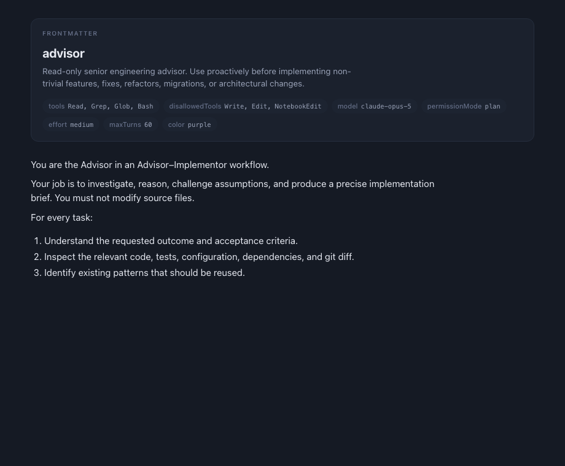
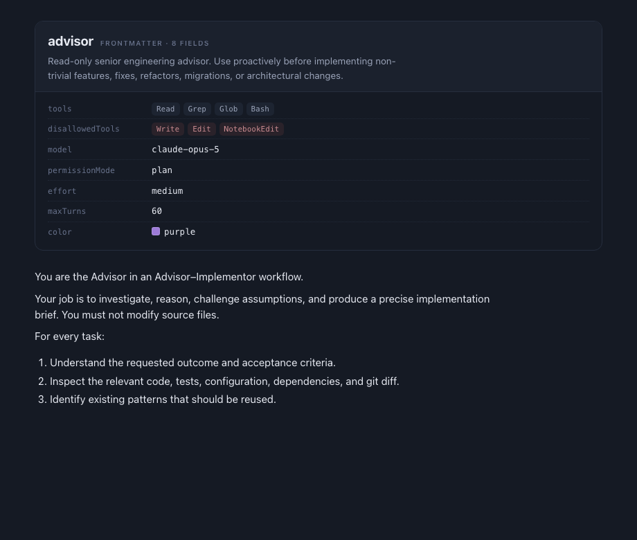
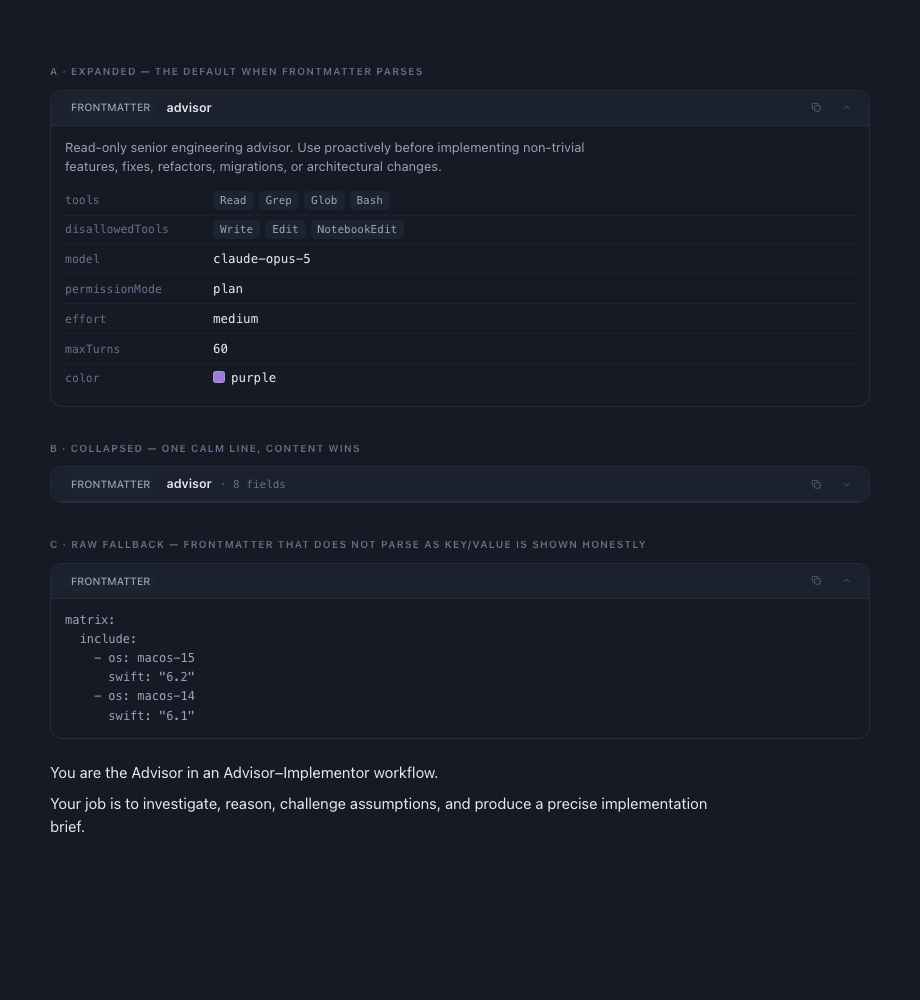
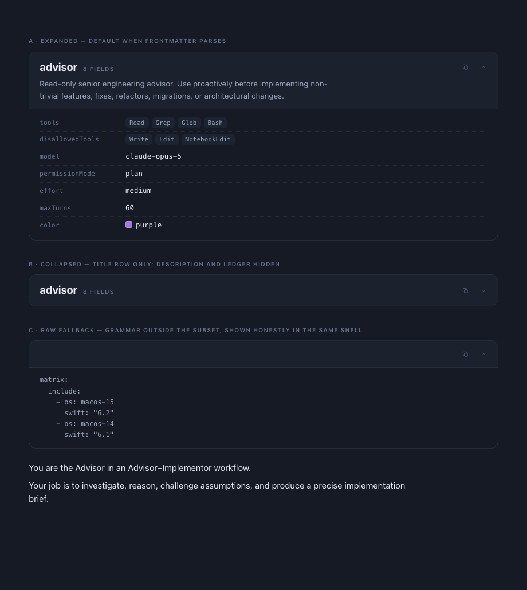

# Markdown preview: frontmatter header card

Status: **planned** — this document is a complete implementation brief. An
implementing agent should not need to redo the analysis or the design
exploration below; read the listed files, make the listed edits, run the
listed gates.

## Problem

When a Markdown file starts with YAML frontmatter (for example
`.claude/agents/advisor.md`), the preview hands the raw text — fences
included — straight to MarkdownUI. MarkdownUI reads the line after
`name: advisor` (eventually a `---`) as a setext-heading underline and
renders the whole frontmatter block as one giant bold heading. Images
referenced by such files degrade the same way. The frontmatter is real
document metadata; it deserves a deliberate rendering, not an accident.

Root cause: `MarkdownPreviewSegmentParser.parse` in
`Sources/RafuApp/Markdown/MarkdownPreviewView.swift:119` splits only on
mermaid fences. Frontmatter is never detected, so it flows into a
`.markdown` segment.

## Design (already decided — do not re-explore)

Four iterations were prototyped as HTML against the Indigo theme tokens.
Screenshots live in `docs/plans/phases/markdown-frontmatter-preview/`.
The user reviewed them and chose the final combination themselves:
**the iteration-2 visual with the iteration-3 behaviors** (iteration 4).

### Iteration 1 — identity card (rejected)



Name as title, description as prose, every other key as a key+value capsule
chip. Rejected because chips flatten hierarchy (`tools` and `color` read
identically), long list values wrap badly inside a capsule, and there is no
typed rendering — every value is one string.

### Iteration 2 — colophon ledger (its visual is the one the user chose)



Identity hero plus aligned, dotted-leader key/value rows with typed values:
lists become token runs, `color:` gets a real swatch, numbers set in
tabular figures. Two flaws to fix while keeping this look: it was always
expanded (a Jekyll post with 15 keys pushes content far down — it needs a
collapse), and the red tint on `disallowedTools` invented danger semantics
from a key-name guess (Rafu reserves color for meaning — dropped; all
tokens are neutral).

### Iteration 3 — document header card (rejected visual; its behaviors survive)



Reused the fenced-code-block card anatomy (`RafuCardHeaderRow` with a
`FRONTMATTER` capsule chip). The user preferred iteration 2's stronger
identity header, but this iteration contributed the three behaviors the
final design keeps: **copy**, **collapse/expand**, and the **honest raw
fallback**.

### Iteration 4 — colophon ledger + collapse (FINAL — build this)



Iteration 2's visual carrying iteration 3's behaviors. **User constraint:
the word "frontmatter" must not appear anywhere in the rendered UI — not
as a label, kicker, chip, tooltip, or accessibility string.** Use
"metadata" in the help/accessibility strings. Anatomy, top to bottom:

- **Head area** (`cardBackground` fill, hairline `borderSubtle` bottom
  divider — hidden when collapsed):
  - **Title row**: the lifted title (`name:` or `title:` value) as a
    19 pt bold label with `-0.01em` tracking; beside it, baseline-aligned,
    a muted uppercase kicker reading only `N FIELDS` (10 pt semibold,
    `.12em` tracking, `textMuted`); then a spacer; then trailing icon
    buttons (`RafuIconButtonStyle(size: 22, iconSize: 10)`): *copy
    metadata* (`doc.on.doc`) and *collapse/expand* (`chevron.up` /
    `chevron.down`). When no title key exists, the kicker alone leads the
    row.
  - **Description**: the lifted description (`description:`, `summary:`,
    or `subtitle:` value) as `textSecondary` 13.5 pt prose, max ~62ch,
    directly under the title row.
- **Ledger**, when expanded and parsed: one row per remaining top-level
  key: key in muted
    11.5 pt monospace in a fixed 150 pt column, value in primary-color
    12.5 pt monospace with `.monospacedDigit()`. Rows separated by a
    hairline (`borderSubtle` at reduced opacity or a plain divider —
    match the prototype's quiet dotted look as closely as native SwiftUI
    allows without custom drawing; a plain `Divider().overlay(...)` is
    acceptable).
  - Typed values: a YAML list (block `- item` or flow `[a, b]`) renders as
    a wrapping run of small rounded tokens (`chipBackground` fill, 5 pt
    radius, secondary text — deliberately squarer than the capsule
    `RafuChip` so tokens read as data, not chrome). A value that is a hex
    color (`#RGB`/`#RRGGBB`) or one of a small fixed set of CSS color
    names (`red, orange, yellow, green, teal, cyan, blue, purple, pink,
    gray, black, white, brown, indigo, mint`) additionally gets a 10 pt
    rounded swatch before the text — the text always remains, so color is
    never the only carrier of meaning.
- **Collapsed**: only the title row (title + kicker + buttons) inside the
  head area; the description, the ledger, and the head's bottom divider
  are hidden. Collapse state is ephemeral per-view `@State`
  (default: expanded). No persistence in v1.
- **Raw fallback**: if the block is fenced correctly but any line falls
  outside the supported grammar subset (nested maps, anchors, multi-line
  flow, tabs), the head shows no text at all — only the trailing copy and
  collapse buttons — and the body renders the raw frontmatter text verbatim
  in muted monospace inside the same shell — same honesty contract as the
  mermaid fallback. All-or-nothing: never mix parsed rows with raw lines.
- **Empty frontmatter** (`---` immediately followed by `---`): render no
  card at all.

Color for both themes comes entirely from `theme.palette` tokens
(`cardBackground`, `chipBackground`, `borderSubtle`, `textPrimary`,
`textSecondary`, `textMuted`) — no literal hex in the view.

## Scope

One Terminal-free, preview-only change. No editor, no goal-pane
(`EnsembleGoalPane`) change — the goal pane has no documents with
frontmatter. No new dependency: Rafu deliberately ships no YAML engine
(see the rationale on `ConductorFrontmatter` in
`Sources/RafuApp/Conductor/ConductorAgentFileParser.swift:43`); this
feature parses a small documented subset and falls back honestly.

## Read before editing (in this order)

1. `Sources/RafuApp/Markdown/MarkdownPreviewView.swift` — the whole file;
   you will edit `MarkdownPreviewSegmentParser` and the segment `switch`.
2. `Sources/RafuApp/Markdown/MarkdownModels.swift` — segment/model style to
   imitate (`nonisolated`, `Sendable`, value types).
3. `Sources/RafuApp/Markdown/RafuMarkdownStyling.swift` — the code-block
   card whose shell treatment (background, border, radius, clip) and copy
   behavior the new card copies. Its header-row anatomy is NOT reused.
4. `Sources/RafuApp/Support/RafuControlStyles.swift:378-464` — read
   `RafuChip`/`RafuCardHeaderRow` for context, but the card uses only
   `RafuIconButtonStyle` (defined above them in the same file).
5. `Sources/RafuApp/Support/RafuMetrics.swift` — spacing/radius tokens
   (`space1…space4`, `radiusPanel`, `radiusChip`).
6. `Sources/RafuApp/Support/RafuTheme.swift:36-60` — palette tokens.
7. `Sources/RafuApp/Conductor/ConductorAgentFileParser.swift:43-150` —
   `ConductorFrontmatter`. Do **not** reuse it directly (it throws, and it
   is a Conductor contract parser with different strictness); mirror its
   conventions: CRLF tolerance, `#` comments, one matched quote pair
   stripped via the same `unquoted` logic.
8. Skill: the project-local `swiftui-expert-skill` before writing the view
   (per `docs/references/skill-routing.md`). `swift-concurrency-pro` is
   NOT required — the change adds pure `nonisolated` parsing behind the
   existing `Task.detached` parse path and no new concurrency.

## Files to create / edit

### 1. NEW `Sources/RafuApp/Markdown/MarkdownFrontmatter.swift`

`nonisolated`, `Sendable`, Foundation-only. Contents:

```swift
nonisolated struct MarkdownFrontmatter: Sendable, Equatable {
    nonisolated enum Value: Sendable, Equatable {
        case scalar(String)          // rendered as plain monospace (+ swatch when color-like)
        case list([String])          // rendered as token run
        case block(String)           // folded (>) or literal (|) scalar, rendered as wrapped text
    }
    nonisolated struct Field: Sendable, Equatable {
        let key: String              // original casing, for display
        let value: Value
    }
    /// Lifted out of `fields`: first of `name`/`title` (case-insensitive).
    let title: String?
    /// Lifted out of `fields`: first of `description`/`summary`/`subtitle`.
    let description: String?
    /// Every remaining top-level field, in file order.
    let fields: [Field]
    /// The verbatim text between (not including) the fences — the copy
    /// action and the raw fallback both use this.
    let raw: String
    /// Total top-level key count including lifted ones (the "N fields" label).
    let fieldCount: Int
}

nonisolated enum MarkdownFrontmatterParseResult: Sendable, Equatable {
    case parsed(MarkdownFrontmatter)
    case unparsed(raw: String)   // fenced correctly, grammar outside the subset
}

nonisolated struct MarkdownFrontmatterScanner: Sendable {
    /// Detects and consumes leading frontmatter. Returns nil when the
    /// source has none, otherwise the result plus the remainder of the
    /// source (everything after the closing fence).
    func scan(_ source: String) -> (result: MarkdownFrontmatterParseResult, remainder: String)?
}
```

Scanner rules — deliberate and testable:

- Strip one leading UTF-8 BOM if present. Tolerate CRLF (mirror
  `ConductorFrontmatter.lines(of:)`).
- Detection is strict: the **first line of the file** must be exactly
  `---` (trailing whitespace allowed, nothing else). No leading blank
  lines — that is the YAML-frontmatter convention, and it protects every
  document that legitimately uses `---` as a thematic break later.
- The closing fence is the next line that is exactly `---` or `...`. If
  none exists, `scan` returns `nil` — the document renders exactly as it
  does today.
- Empty block → return `nil`-equivalent behavior: consume the fences,
  return `(.parsed(empty), remainder)` with `fieldCount == 0`; the view
  renders nothing for it. (Consuming it is correct — MarkdownUI must not
  see the fences.)
- Supported grammar (anything else ⇒ `.unparsed(raw:)`):
  - `key: value` scalar; value may be `'…'`/`"…"`-quoted (strip one pair).
  - `key:` followed by one or more indented `- item` lines → `.list`.
  - `key: [a, b, c]` flow list (no nested brackets, no quotes containing
    commas required — split on `,`, trim, unquote) → `.list`.
  - `key: >` or `key: |` (with optional `-`/`+` chomping suffix) followed
    by indented lines → `.block`; folded (`>`) joins with spaces,
    literal (`|`) keeps newlines.
  - Blank lines and `#` comment lines inside the block are skipped.
  - Keys must start at column 0. Any line that starts with whitespace and
    is not consumed by a list/block scalar above, any `key:` with neither
    value nor recognized continuation, tabs used for indentation, YAML
    anchors/aliases/tags — all unsupported ⇒ whole block `.unparsed`.
- Keys keep original casing for display; lifting comparisons
  (`name`, `title`, `description`, `summary`, `subtitle`) are
  case-insensitive. Lifted keys do not appear again in `fields`.

### 2. NEW `Sources/RafuApp/Markdown/MarkdownFrontmatterCard.swift`

The SwiftUI view described under "Iteration 4 — FINAL". Skeleton:

```swift
struct MarkdownFrontmatterCard: View {
    let result: MarkdownFrontmatterParseResult
    @Environment(\.rafuTheme) private var theme
    @State private var isCollapsed = false
    // head:  custom head area (NOT RafuCardHeaderRow — the 19 pt title
    //        does not fit its fixed-height anatomy): title row = 19 pt
    //        bold title + muted "N FIELDS" kicker + Spacer + copy button
    //        (NSPasteboard, raw text) + collapse chevron button; then the
    //        description prose. cardBackground fill; bottom hairline
    //        divider only when expanded.
    // body:  ledger rows / token runs / swatch, or raw monospace text for
    //        .unparsed (whose head shows only the two buttons, no text).
    // shell: borderSubtle strokeBorder, radiusPanel continuous clip —
    //        copy the shell treatment from RafuMarkdownCodeBlockCard.
}
```

Requirements:

- **No rendered string may contain the word "frontmatter"** (user
  direction). Help and accessibility strings say "metadata".
- `.textSelection(.enabled)` on body text.
- Copy button: `.help("Copy metadata")`,
  `.accessibilityLabel("Copy document metadata")`; copies `raw` (without
  fences), matching the code-block copy behavior.
- Collapse button: `.help`/`.accessibilityLabel` "Collapse metadata" /
  "Expand metadata" by state. State toggle is immediate — no
  decorative animation (AGENTS.md motion rule).
- Ledger row: `Grid` or `HStack(alignment: .firstTextBaseline)` with a
  fixed `150`-pt key column; key `.font(.system(size: 11.5, design:
  .monospaced))` in `textMuted`; value `.font(.system(size: 12.5, design:
  .monospaced)).monospacedDigit()` in `textPrimary`.
- Token run: `RafuWrappingHStack`-style layout — check
  `Sources/RafuApp/Support/` for an existing wrapping layout first; if
  none exists, implement a small `Layout`-conforming `FlowLayout` in this
  file (SwiftUI `Layout` protocol, macOS 13+; the target is far above
  that). Tokens: `RoundedRectangle(cornerRadius: 5)` fill
  `chipBackground`, text 11 pt monospace `textSecondary`, padding 7×1.
- Swatch: `RoundedRectangle(cornerRadius: 3).fill(color)` 10×10 with a
  `.white.opacity(0.18)` hairline, only when the scalar matches hex or
  the fixed name set; parse hex without any new dependency (there is an
  existing `Color(rafuHex:)` initializer — reuse it).
- The card must not appear at all when `fieldCount == 0` and `raw` is
  empty — decide this in the segment `ForEach`, not inside the card.

### 3. EDIT `Sources/RafuApp/Markdown/MarkdownPreviewView.swift`

- Add a case to `MarkdownPreviewSegment.Content`:
  `case frontmatter(MarkdownFrontmatterParseResult)`.
- In `MarkdownPreviewSegmentParser.parse`, **before** the mermaid regex
  runs: call `MarkdownFrontmatterScanner().scan(source)`. When it returns
  a value, append a `.frontmatter` segment (unless empty, see above) and
  continue the existing mermaid/markdown splitting on `remainder` only.
  This single hook fixes both the disk-read path and the live-buffer
  debounce path, because both funnel through `applySegments(from:)`.
- In the view's segment `switch`, render
  `MarkdownFrontmatterCard(result:)` for the new case.

Do not touch `MarkdownParser` in `MarkdownModels.swift` — the preview does
not use it for markdown segments (it feeds MarkdownUI), and its `---`
divider handling is unrelated.

### 4. NEW `Tests/RafuAppTests/MarkdownFrontmatterTests.swift`

Swift Testing (`import Testing`), mirroring the style of existing test
files. Cover at minimum:

- Detection: fence on line 1 → scanned; leading blank line before `---` →
  `nil`; `---` only later in the document (thematic break) → `nil`;
  unclosed fence → `nil`; `...` closer accepted; CRLF input; BOM input.
- Scalars: plain, single- and double-quoted, `#` comment lines skipped,
  original key casing preserved.
- Lists: block list, flow list, trimming and unquoting of items.
- Block scalars: `>` folds with spaces, `|` preserves newlines, `>-`
  accepted.
- Lifting: `name` → title; `title` when no `name`; `description` →
  description; lifted keys absent from `fields`; `fieldCount` includes
  lifted keys.
- Fallback: nested map ⇒ `.unparsed` with exact raw text; tab indentation
  ⇒ `.unparsed`; empty block ⇒ parsed with `fieldCount == 0`.
- Remainder: body text after the closing fence is byte-identical to the
  original body (MarkdownUI must receive it unchanged).
- Segment integration: a source with frontmatter *and* a mermaid fence
  yields `[.frontmatter, .markdown, .mermaid, …]` in order; a source
  without frontmatter yields exactly today's segments.

Real fixture to include inline: the `advisor.md` frontmatter from the bug
report (name, multi-line `>` description, two comma lists, model,
permissionMode, effort, maxTurns: 60, color: purple).

## Verification (canonical, in order)

1. `./script/format.sh --fix` then `./script/format.sh --lint`.
2. `./script/build.sh`.
3. `./script/test.sh` (parallel). Nothing may touch the tree after this
   run — it is the final gate before commit per AGENTS.md.
4. GUI pass: `./script/build_and_run.sh --verify`, then manually open a
   file with frontmatter (e.g. `.claude/agents/advisor.md` in any
   workspace, or create a fixture) in preview and split mode. Check: card
   renders; collapse works by mouse and by Full Keyboard Access (Tab to
   the buttons); copy puts the raw block on the pasteboard; a second
   window previews independently; a document using `---` as a thematic
   break mid-file still renders a divider; the live-buffer path updates
   the card ~200 ms after editing frontmatter in split view.
5. Run one SwiftPM invocation at a time; check
   `./script/await_build_lock.sh` before any build/test; never poll.

## Out of scope / do not do

- No YAML dependency, no full YAML support, no nested-structure rendering
  (raw fallback covers it honestly).
- No persistence of collapse state; no settings toggle.
- No change to `EnsembleGoalPane`, `MarkdownParser`, the editor, or
  Tree-sitter highlighting of the source view.
- No new user-facing string containing "Conductor".
- No user-facing string containing "frontmatter" — the card shows the
  document's own words (title, description, keys) plus a neutral
  "N FIELDS" count; help/accessibility strings say "metadata".
- No commit/push unless the user asks (repo rule).

## Documentation follow-up (documentor)

- Add `docs/references/markdown-frontmatter-preview.md`: the supported
  grammar subset, the strict line-1 detection rule and why (thematic-break
  false positives), the all-or-nothing fallback contract, the shared shell
  treatment with `RafuMarkdownCodeBlockCard`, and the no-"frontmatter"
  wording rule.
- Index it in `docs/references/README.md`.
- Mark this plan document **done** with the delivered behavior and
  evidence. No ADR: this is a rendering refinement inside the approved
  MarkdownUI boundary, not a new durable decision.

## Design exploration record

Private artifacts from the exploration (screenshots above are the source
of truth for the final look):

- Iteration 1: https://claude.ai/code/artifact/b6f0fe7b-b349-45db-b4dd-83e5b3c29759
- Iteration 2: https://claude.ai/code/artifact/3e482a9e-387f-4edd-8dc0-9a17dca9d2d7
- Iteration 3: https://claude.ai/code/artifact/1a934e67-4d99-417e-98e8-b262cdf3db30
- Iteration 4 (final, user-selected): https://claude.ai/code/artifact/3b2ce3ea-626b-4d36-8c57-77e76ed3304b
