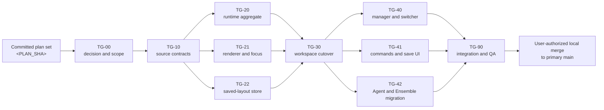

# Terminal Groups — worktree execution contract

## Status

Active on 2026-08-16 after ADR 0023 acceptance. TG-00 and TG-10 are complete
and merged to primary `main`. Wave 2 is ready from the exact TG-10 merge.

The live lane state, worker assignment, branch, and approved SHA are in
[`manifest.md`](manifest.md).

## Terminal Groups v2

The user directed a v2 extension on 2026-08-17: 20 groups per window, 10 panes
per group, an independent 200-retained-pane and 200-live-session window bound,
safe pane naming and theme color, compact colored pane chrome, and icon-only
three-dot sidebar menus. The serial and parallel lane order is in the v2 graph
in [`manifest.md`](manifest.md). TG-100 freezes contracts first; TG-110 applies
them; TG-120 and TG-130 then run from the same approved base; TG-190 performs
the integrated audit. All v2 implementation workers are Luna Implementors in
coordinator-created worktrees.

This directory decomposes
[`../terminal-groups.md`](../terminal-groups.md) into two serial foundation
plans, two parallel implementation waves, one serial workspace cutover, and
one final integration plan. It does not broaden the parent phase.

## Execution graph



TG-20, TG-21, and TG-22 start from the same exact TG-10 merge commit. TG-40,
TG-41, and TG-42 start from the same exact TG-30 merge commit. Parallel lanes
have no intended source or test path overlap. Merge each result serially.

## Plans, branches, and ownership

| Plan | Branch | Wave | Primary ownership |
|---|---|---:|---|
| [TG-00](TG-00-decision.md) | `terminal-groups/tg-00-decision` | 0, serial | ADR 0023 and all durable scope changes |
| [TG-10](TG-10-source-contracts.md) | `terminal-groups/tg-10-contracts` | 1, serial | IDs, snapshots, editor resource, restoration DTO |
| [TG-20](TG-20-runtime.md) | `terminal-groups/tg-20-runtime` | 2, parallel | manager aggregate, lifecycle, capacity |
| [TG-21](TG-21-renderer-focus.md) | `terminal-groups/tg-21-renderer-focus` | 2, parallel | recursive split renderer and AppKit focus bridge |
| [TG-22](TG-22-persistence.md) | `terminal-groups/tg-22-persistence` | 2, parallel | safe codec and Application Support saved-layout store |
| [TG-30](TG-30-workspace-integration.md) | `terminal-groups/tg-30-workspace-integration` | 3, serial | `WorkspaceSession`, editor canvas, restoration cutover |
| [TG-40](TG-40-manager-switcher.md) | `terminal-groups/tg-40-manager-switcher` | 4, parallel | Terminal Manager hierarchy and Control-Tab |
| [TG-41](TG-41-commands-save-ui.md) | `terminal-groups/tg-41-commands-save-ui` | 4, parallel | menu, palette, Save/Save As, save sheet |
| [TG-42](TG-42-agent-ensemble.md) | `terminal-groups/tg-42-agent-ensemble` | 4, parallel | Agent route audit and Ensemble caller migration |
| [TG-90](TG-90-integration-qa.md) | `terminal-groups/tg-90-integration-qa` | 5, serial | final defects, measurements, security, docs |

Use a frontier coding model with high reasoning for TG-10, TG-20, TG-21,
TG-30, TG-42, and TG-90. A balanced coding model with high reasoning is
sufficient for TG-00, TG-22, TG-40, and TG-41. This is a recommendation, not
a product decision.

## Coordinator preparation

The merge owner works in the local primary checkout on `main`. The merge owner
does not run implementation in that checkout. This planning request authorizes
the plan files only. It does not authorize a future lane merge. After each lane
handoff, show the result to the user and get explicit authorization before the
local merge to `main`.

1. Review and commit this complete plan set. Record its exact commit as
   `<PLAN_SHA>`.
2. Confirm the primary checkout is on `main` and clean before each worktree is
   created and before each merge. Do not switch a dirty checkout.
3. Run `df -h .` before each parallel wave. Budget up to 5 GB for each active
   worktree cache. Reduce the number of simultaneous gates if disk space is
   low.
4. Run only one SwiftPM command at one time across the checkout and its
   worktrees. A parallel implementation wave does not authorize parallel
   SwiftPM gates.
5. Use only Rafu Lightning for app launch and GUI checks. Never launch, stop,
   `pgrep`, or `pkill` the release Rafu app.

## Branch and worktree procedure

### 1. Run TG-00 from the plan commit

```bash
git worktree add ../rafu-tg-00-decision \
  -b terminal-groups/tg-00-decision <PLAN_SHA>
```

Dispatch the complete Goal Mode prompt from TG-00. Review its owned-path diff.
After explicit user authorization, merge the local branch into primary
`main`. Record the merge commit as `<TG00_MERGED_SHA>`.

### 2. Run TG-10 from the exact TG-00 merge

```bash
git worktree add ../rafu-tg-10-contracts \
  -b terminal-groups/tg-10-contracts <TG00_MERGED_SHA>
```

TG-10 must compile and pass the parallel suite without changing live terminal
behavior. Merge it, then record the exact merge commit as
`<TG10_MERGED_SHA>`.

### 3. Create Wave 2 from one exact TG-10 merge commit

```bash
git worktree add ../rafu-tg-20-runtime \
  -b terminal-groups/tg-20-runtime <TG10_MERGED_SHA>
git worktree add ../rafu-tg-21-renderer \
  -b terminal-groups/tg-21-renderer-focus <TG10_MERGED_SHA>
git worktree add ../rafu-tg-22-persistence \
  -b terminal-groups/tg-22-persistence <TG10_MERGED_SHA>
```

The three agents can edit at the same time. Serialize their final build and
test commands. Merge in this order:

1. TG-20 runtime;
2. TG-22 persistence; and
3. TG-21 renderer and focus.

After all three merges and merge gates, record `<WAVE2_MERGED_SHA>`.

### 4. Run TG-30 from the exact Wave 2 merge

```bash
git worktree add ../rafu-tg-30-workspace \
  -b terminal-groups/tg-30-workspace-integration <WAVE2_MERGED_SHA>
```

TG-30 is the only plan that performs the main workspace cutover. Merge it only
after its headless and Rafu Lightning gates are green. Record the merge commit
as `<TG30_MERGED_SHA>`.

### 5. Create Wave 4 from one exact TG-30 merge commit

```bash
git worktree add ../rafu-tg-40-manager \
  -b terminal-groups/tg-40-manager-switcher <TG30_MERGED_SHA>
git worktree add ../rafu-tg-41-commands \
  -b terminal-groups/tg-41-commands-save-ui <TG30_MERGED_SHA>
git worktree add ../rafu-tg-42-agents \
  -b terminal-groups/tg-42-agent-ensemble <TG30_MERGED_SHA>
```

Merge in this order:

1. TG-40 manager and switcher;
2. TG-41 commands and save UI; and
3. TG-42 Agent and Ensemble migration.

After all three merges and merge gates, record `<WAVE4_MERGED_SHA>`.

### 6. Run TG-90 from the complete implementation

```bash
git worktree add ../rafu-tg-90-integration \
  -b terminal-groups/tg-90-integration-qa <WAVE4_MERGED_SHA>
```

TG-90 owns the integrated test matrix, security inspection, Release
measurements, Rafu Lightning pass, and documentation close-out. Merge its one
local commit only when the full gate is green.

All merges in this procedure target the local primary `main` checkout and need
separate user authorization. Do not push, open a pull request, publish, or
release without separate user direction.

## Exact-base and prompt rules

Before dispatch, replace the base placeholder only in the copied Goal Mode
prompt with the recorded immutable SHA for that wave. Do not edit the tracked
plan file, and do not substitute `main` or a branch name.

The pasted prompt gives authority for one local commit on the stated lane
branch. It does not give authority to merge, push, rebase, publish, release,
or edit the primary checkout.

Every implementation agent must:

- call `create_goal` first with the objective in its prompt and no token
  budget;
- verify the exact branch, clean state, and exact starting SHA;
- read all listed files and skills before implementation;
- edit only its exclusive paths;
- run the full parallel test suite as the last tracked-file gate;
- create one local commit;
- report all deviations in a named **Deviations** section; and
- remove only that worktree's `.build` after the green commit.

Project-local skill paths are rooted at `.agents/skills/`. For a named Build
macOS Apps skill, use its exact `main_resource` from the active Skills catalog
and resolve each named reference relative to that `SKILL.md`. Do not search the
repository or select a similarly named duplicate.

## Zero-conflict ownership

### Serial choke points

These files never have concurrent owners:

- `Sources/RafuApp/Editor/EditorLayout.swift` — TG-10;
- `Sources/RafuApp/Editor/EditorTabSwitcher.swift` — TG-10 for the additive
  group-destination contract, then TG-40 for final presentation behavior;
- `Sources/RafuApp/Services/WorkspaceRestorationStore.swift` — TG-10;
- `Sources/RafuApp/Terminal/WorkspaceTerminalController.swift` — TG-20, then
  TG-90 only for proven cleanup;
- `Sources/RafuApp/Models/WorkspaceSession.swift` — TG-10 for the additive
  enum compile shim, TG-30 for behavior, then TG-90 only for a proved defect;
- `Sources/RafuApp/Views/EditorCanvasView.swift` — TG-10 for the additive enum
  compile shim, TG-30 for behavior, then TG-90 only for a proved defect;
- `Sources/RafuApp/Views/EditorTabSwitcherView.swift` — TG-10 for the additive
  enum compile shim, then TG-40 for presentation;
- `Sources/RafuApp/Views/WorkspaceWindowView.swift` — TG-30, then TG-41;
- `docs/decisions/README.md` — TG-00, then TG-90;
- `docs/references/README.md` — TG-90; and
- `docs/plans/phases/README.md` — TG-00, then TG-90.

### Wave 2 exclusive paths

| Plan | Exclusive production paths |
|---|---|
| TG-20 | `WorkspaceTerminalController.swift`; new `TerminalGroupRuntime.swift` |
| TG-21 | new `TerminalGroupView.swift`; new `TerminalGroupSplitView.swift`; `EditorTerminalTabContent.swift`; `RafuTerminalView.swift` |
| TG-22 | new `TerminalGroupRestorationCodec.swift`; new `TerminalGroupSavedLayoutStore.swift` |

Wave 2 test ownership is also disjoint:

| Plan | Exclusive test paths |
|---|---|
| TG-20 | new `TerminalGroupRuntimeTests.swift`; new `TerminalGroupLifecycleTests.swift`; new `TerminalGroupCapacityTests.swift` |
| TG-21 | new `TerminalGroupViewPresentationTests.swift`; new `TerminalGroupFocusBridgeTests.swift`; new `TerminalGroupSplitViewTests.swift` |
| TG-22 | new `TerminalGroupRestorationTests.swift`; new `TerminalGroupSavedLayoutStoreTests.swift`; new `TerminalGroupPersistenceSecurityTests.swift` |

### Wave 4 exclusive paths

| Plan | Exclusive production paths |
|---|---|
| TG-40 | `TerminalsPanelModel.swift`; `WorkspaceTerminalsPanelView.swift`; `EditorTabSwitcher.swift`; `EditorTabSwitcherView.swift`; new `TerminalGroupSavedLayoutsSection.swift` |
| TG-41 | `RafuAppCommands.swift`; `CommandPaletteView.swift`; `WorkspaceWindowView.swift`; new `TerminalGroupSaveSheet.swift`; new `TerminalPaneStartingFolderPicker.swift` |
| TG-42 | `WorkspaceConductorRunLauncher.swift`; `ConductorCoordinatorLauncher.swift` |

Wave 4 test ownership is also disjoint:

| Plan | Exclusive test paths |
|---|---|
| TG-40 | `TerminalsPanelTests.swift`; `TerminalIdentityTests.swift`; `TerminalManagerPresentationTests.swift`; `EditorTabSwitcherTests.swift`; new `TerminalGroupManagerHierarchyTests.swift`; new `TerminalGroupSwitcherPresentationTests.swift` |
| TG-41 | `SearchCommandPaletteTests.swift`; new `TerminalGroupCommandPresentationTests.swift`; new `TerminalGroupSaveSheetTests.swift`; new `TerminalPaneStartingFolderPickerTests.swift` |
| TG-42 | `AgentTerminalTests.swift`; `Conductor/ConductorTerminalSpecTests.swift`; `Conductor/RunTerminalTests.swift`; `Conductor/EnsembleCoordinatorLaunchTests.swift`; new `Conductor/TerminalGroupAgentIntegrationTests.swift`; new `Conductor/TerminalGroupEnsembleIntegrationTests.swift` |

Each child plan gives the exact test ownership. A textual conflict between
parallel lanes means that a lane exceeded ownership or started from the wrong
base. Stop and investigate. Do not choose one side by intuition.

TG-30 first updates `EditorThemeColorApplicationTests.swift`,
`EditorTabSwitcherTests.swift`, `TerminalManagerPresentationTests.swift`,
`AgentTerminalTests.swift`, and
`Conductor/EnsembleCoordinatorLaunchTests.swift` for the serial group cutover.
TG-40 and TG-42 then own their listed follow-up edits from the merged TG-30
base. This is sequential ownership, not parallel overlap.

`Package.swift`, `Package.resolved`, `.codex/**`, build scripts, resources,
shared indexes, and another lane's files are read-only unless one child plan
gives exact ownership. SwiftPM discovers the planned new Swift source and test
files without package metadata changes.

## Documentation during parallel work

Each plan before TG-90 can update only its own Status and implementation
record. Before its final gate, it marks the status `Implemented on lane;
awaiting authorized merge` and records its evidence. TG-90 owns the final
integrated-status pass and marks its own plan and all completed predecessor
plans `Integrated and Verified`.

A lane can add only its reserved reference path below, and only when
implementation proves a reusable platform, lifecycle, security, performance,
or test fact that current references do not cover:

| Lane | Reserved optional reference path |
|---|---|
| TG-10 | `docs/references/terminal-group-contract-isolation.md` |
| TG-20 | `docs/references/terminal-group-runtime-lifecycle.md` |
| TG-21 | `docs/references/terminal-group-appkit-split-focus.md` |
| TG-22 | `docs/references/terminal-group-saved-layout-store.md` |
| TG-30 | `docs/references/terminal-group-workspace-restoration.md` |
| TG-40 | `docs/references/terminal-group-manager-switcher.md` |
| TG-41 | `docs/references/terminal-group-command-routing.md` |
| TG-42 | `docs/references/terminal-group-agent-ensemble-lifecycle.md` |

Do not choose another note path. A lane must not edit a shared index. Its
handoff gives the exact index row that TG-90 must add when the optional note
exists.

If code conflicts with ADR 0023, the lane stops and reports the conflict. A
lane does not amend the ADR to match its implementation.

## Common implementation gate

Every plan, including documentation and contract plans, runs this final order:

```bash
./script/format.sh --fix
./script/format.sh --lint
./script/build.sh
./script/test.sh
```

`./script/test.sh` is the full parallel suite and is the last tracked-file
gate. Nothing can modify a tracked file after it. If a tracked file changes,
repeat the full sequence.

Before a long run, follow the build-lock contract in `AGENTS.md`. Do not start
a second SwiftPM process while `.build/.lock` is held. Do not poll. A lane that
needs GUI evidence acquires the one Rafu Lightning lease or reports the exact
deferred states for the user-authorized local merge round.

After a green lane commit, remove only the dedicated worktree's `.build` as
the last filesystem step. Never remove the primary checkout cache.

## Merge audit and local merge gate

Before each authorized merge, the merge owner runs the equivalent of:

```bash
git status --short --branch
git branch --show-current
git -C <LANE_WORKTREE> status --short --branch
git -C <LANE_WORKTREE> rev-parse HEAD
git merge-base --is-ancestor <BASE_SHA> <LANE_BRANCH>
git diff --name-status <BASE_SHA>...<LANE_BRANCH>
git log --oneline <BASE_SHA>..<LANE_BRANCH>
```

Stop unless the primary checkout is clean and its branch is exactly `main`.
Stop unless the lane worktree is clean and its HEAD is the reported
`<LANE_SHA>`. Reject a handoff with a foreign path, missing gate evidence, a
dirty branch, an unexpected HEAD, or an unexplained deviation.

Merge one local branch, then run:

```bash
git merge --no-ff --no-edit <LANE_BRANCH>
./script/format.sh --lint
./script/build.sh
./script/test.sh
./script/test.sh --no-parallel
```

Run one SwiftPM command at one time. When a merge changes source, tests,
resources, scenes, packaging, or launch behavior, also run Rafu Lightning
verification:

```bash
./script/build_and_run.sh --verify
```

The merge owner records merge conflicts, manual deferrals, and gate results
before the next worktree starts from the exact merged SHA. After the
user-authorized TG-90 merge, run format lint, build, parallel tests, serial
tests, and Rafu Lightning verification again on primary `main`. Do not push.

## Required handoff format

Each lane handoff reports:

- delivered behavior;
- changed paths;
- focused test results;
- full parallel test total and duration;
- build result and warning count;
- Rafu Lightning and manual evidence;
- deferred GUI, accessibility, hardware, or Release checks;
- security, restoration, performance, and concurrency findings;
- ADR or reusable reference work;
- lane plan Status and implementation-record result;
- remaining risks;
- next integration dependency;
- branch name, commit message, and final commit SHA; and
- **Deviations**, with `None` when there are no deviations.

For each deviation, name the contract item, exact evidence, reason, affected
path or gate, owner, user authorization if any, and merge-owner action. A red
required gate is a blocked handoff. It is not a completed lane.

## Set-level exit

The Terminal Groups set is complete only when:

1. ADR 0023 is Accepted and all affected decisions and phase documents agree.
2. Every lane commit descends from the correct exact base and changes only its
   owned paths.
3. One tab can host one, right-split, down-split, mixed, and nested groups.
4. Keyboard and pointer focus remain correct with SwiftTerm as first responder.
5. Rename, Save, Save As, open, delete, inert restore, Start Pane, and Start All
   Restartable Panes pass automated and manual checks.
6. Restore creates zero processes and saved data contains no prohibited field.
7. The six-pane, 24-retained-pane, and six-live-session limits hold. Rejected
   retained-capacity and multi-start preflight operations change no state and
   start zero processes, and later external failures use the documented
   per-pane result.
8. Terminal Manager, Control-Tab, attention, Resources, Agent Terminal, and
   Ensemble behavior use the same group/session mapping.
9. Two windows preserve concurrent named-layout writes and refresh, while
   workspace switch, window close, and app quit pass lifecycle checks.
10. VoiceOver, Full Keyboard Access, larger text, Increase Contrast, Reduce
    Transparency, and Reduce Motion pass.
11. Release evidence covers memory and typing with 1, 4, and 6 visible active
    panes and memory/zero-process behavior with 24 inert panes.
12. Format, build, parallel tests, serial tests, and Rafu Lightning launch are
    green on the integrated tree.
13. TG-90 closes all phase, decision, reference, and index documentation.
