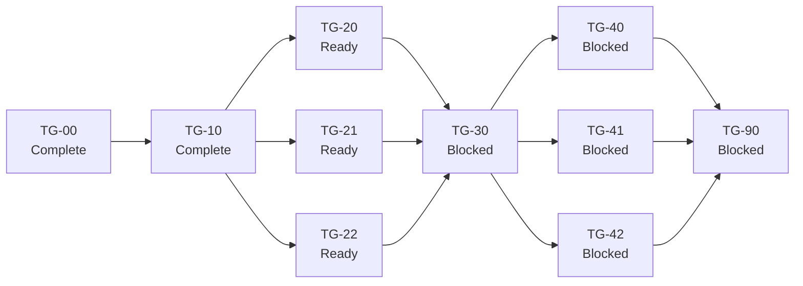

# Terminal Groups execution manifest

The primary coordinator creates each branch and worktree at the exact required
base before dispatch. A worker switches to the listed existing branch. A worker
does not create, replace, or rebase the branch.

## Execution order

## Lane state

| Plan | Depends on | Worker | Branch | Status | Approved SHA |
|---|---|---|---|---|---|
| [TG-00](TG-00-decision.md) | — | Terra | `terminal-groups/tg-00-decision` | Complete | `5cece853c12c9ada8100303a36b3d4a335980e59` |
| [TG-10](TG-10-source-contracts.md) | TG-00 | Terra | `terminal-groups/tg-10-contracts` | Complete | `85197f0b8bed654570c977fd982a247236dc171f` |
| [TG-20](TG-20-runtime.md) | TG-10 | Terra | `terminal-groups/tg-20-runtime` | Ready | — |
| [TG-21](TG-21-renderer-focus.md) | TG-10 | Terra | `terminal-groups/tg-21-renderer-focus` | Ready | — |
| [TG-22](TG-22-persistence.md) | TG-10 | Terra | `terminal-groups/tg-22-persistence` | Ready | — |
| [TG-30](TG-30-workspace-integration.md) | TG-20, TG-21, TG-22 | Terra | `terminal-groups/tg-30-workspace-integration` | Blocked | — |
| [TG-40](TG-40-manager-switcher.md) | TG-30 | Terra | `terminal-groups/tg-40-manager-switcher` | Blocked | — |
| [TG-41](TG-41-commands-save-ui.md) | TG-30 | Terra | `terminal-groups/tg-41-commands-save-ui` | Blocked | — |
| [TG-42](TG-42-agent-ensemble.md) | TG-30 | Terra | `terminal-groups/tg-42-agent-ensemble` | Blocked | — |
| [TG-90](TG-90-integration-qa.md) | TG-40, TG-41, TG-42 | Terra | `terminal-groups/tg-90-integration-qa` | Blocked | — |

`Approved SHA` is the final lane commit that the primary coordinator approved.
TG-00 is on `main` through merge commit
`ea8ec9910d1b6c380feeb6bbc96febbd162ecfdf`. TG-10 is on `main` through merge
commit `b52f9c8153822911505fd5d7d211ac30288c7b3f`.

`Ready` means that all dependencies are complete and the local branch exists.
`Blocked` means that one or more dependencies are not complete. The primary
coordinator updates this file after each approved merge.
