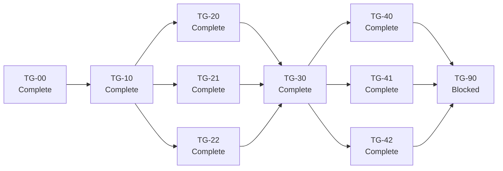

# Terminal Groups execution manifest

The primary coordinator creates each branch and worktree at the exact required
base before dispatch. A worker switches to the listed existing branch. A worker
does not create, replace, or rebase the branch.

## Execution order

## Lane state

| Plan | Depends on | Worker | Branch | Status | Approved SHA |
|---|---|---|---|---|---|
| [TG-00](TG-00-decision.md) | — | Terra | `terminal-groups/tg-00-decision` | Complete | `5cece853c12c9ada8100303a36b3d4a335980e59` |
| [TG-10](TG-10-source-contracts.md) | TG-00 | Terra | `terminal-groups/tg-10-contracts` | Complete | `85197f0b8bed654570c977fd982a247236dc171f` |
| [TG-20](TG-20-runtime.md) | TG-10 | Terra | `terminal-groups/tg-20-runtime` | Complete | `306b7ce0f59a80b3d6b37458679c2f4caa037f65` |
| [TG-21](TG-21-renderer-focus.md) | TG-10 | Terra | `terminal-groups/tg-21-renderer-focus` | Complete | `aa02dcbec6f4bc56f291473867952b8e85444d95` |
| [TG-22](TG-22-persistence.md) | TG-10 | Terra | `terminal-groups/tg-22-persistence` | Complete | `70580d2152401e53223b4d7ee86a2eaebf519326` |
| [TG-30](TG-30-workspace-integration.md) | TG-20, TG-21, TG-22 | Terra | `terminal-groups/tg-30-workspace-integration` | Complete | `02bc5fca3dc61d311625ca08e82211aef86516ed` |
| [TG-40](TG-40-manager-switcher.md) | TG-30 | Terra | `terminal-groups/tg-40-manager-switcher` | Complete | `ed1585b0c9318c4e1b338cd3d366aabefb1e9ba7` |
| [TG-41](TG-41-commands-save-ui.md) | TG-30 | Terra | `terminal-groups/tg-41-commands-save-ui` | Complete | `59357fcd6155744d7adc13511028f470cb642b40` |
| [TG-42](TG-42-agent-ensemble.md) | TG-30 | Terra | `terminal-groups/tg-42-agent-ensemble` | Complete | `a908e853dfde6dd9c1d35c24c08172b338b1b96d` |
| [TG-90](TG-90-integration-qa.md) | TG-40, TG-41, TG-42 | Terra | `terminal-groups/tg-90-integration-qa` | Blocked | — |

`Approved SHA` is the final lane commit that the primary coordinator approved.
TG-00 is on `main` through merge commit
`ea8ec9910d1b6c380feeb6bbc96febbd162ecfdf`. TG-10 is on `main` through merge
commit `b52f9c8153822911505fd5d7d211ac30288c7b3f`. TG-22 is on `main` through merge
commit `593379d6affe57794868f0869df70b3cd6af90e4`. TG-21 is on `main` through merge
commit `140e42b2e1f09e7c5c33fb983f70c687d1b2d902`. TG-20 is on `main` through merge
commit `30902b47d874a1f7f2adbb538a03f93f00353b27`; its TG-30 adoption correction is
on `main` through merge commit `57ab67911329dd8b1afc04fe993eb51b3d07bc80`.
TG-30 is on `main` through merge commit
`a141ee773ab650817802e10dc928530d5015c335`; its integration-test correction is
on `main` at `7bb2488ab17b3e09614e3a5dc69db2030140aab3`. TG-42 is on `main` through
merge commit `fc65d7aab03477a7247bd7cb3e0003c9d8e3bf59`.
TG-40 is on `main` through merge commit
`d1c373d23d3428a499082ee2bdbe9ff748194688`.
TG-41 is on `main` through merge commit
`85ce20e0077c896f716522aab09c3ced373172c9`. Its main integration corrections
are commits `5ae078a9439c5143ae5bacf6af0c874d0f9cfce0`,
`5f6c548017f1224c9219c3d3fb4a0c50fa4113de`,
`6d6f842b427db7e960c50bfcfa37d8b0d0b476f5`, and
`a46f485c2380145e29fdaccc058dc3cd453bdfea`.

TG-90 has an unapproved blocked checkpoint at
`112f0285f75cd557d9f83aa2bc0e3df46bb3539b`. It is not merged. Q5 manual and
accessibility checks and Q6 final active-pane measurements remain open.

`Ready` means that all dependencies are complete and the local branch exists.
`In progress` means that the branch has an active isolated Worktree worker.
`Blocked` means that a dependency or required external gate is not complete.
The primary coordinator updates this file after each approved merge or blocker
change.
