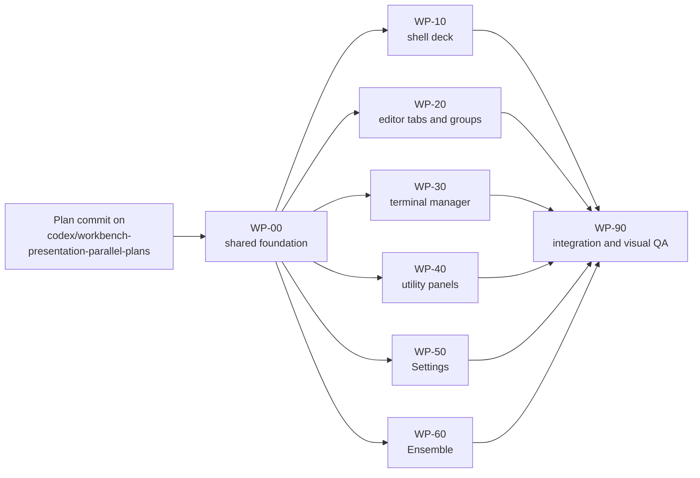

# Workbench presentation upgrade — parallel worktree execution

## Status

Planned on 2026-07-29. This is the execution contract for
[`workbench-presentation-upgrade.md`](../workbench-presentation-upgrade.md).
It splits that design into one contract-first foundation, six implementation
plans that can run concurrently from the same foundation commit, and one final
integration/visual-QA plan.

This folder does not broaden the parent phase. In particular, it adds no
terminal layout commands, no new theme key, no process behavior, no Liquid
Glass, and no feature removal.

## Why the work is waved

The presentation system needs shared metrics, styles, and pure state resolvers.
If six agents invented those independently, every branch would edit the same
support files and the final merge would be a design reconciliation rather than
an integration. WP-00 therefore lands the shared contract first. Every visible
lane then consumes that contract without editing it.



WP-10 through WP-60 have no source or test path overlap. They may execute at
the same time in separate worktrees. Their results merge serially so the
coordinator can attribute a regression to one commit.

## Plans, branches, and model fit

| Plan | Suggested branch | Wave | Recommended model | Primary ownership |
|---|---|---:|---|---|
| [WP-00 Foundation](WP-00-foundation.md) | `codex/presentation-foundation` | 0, serial | `gpt-5.6-sol` high | metrics, control/workbench styles, theme fixture and style contracts |
| [WP-10 Shell deck](WP-10-shell-deck.md) | `codex/presentation-shell-deck` | 1, parallel | `gpt-5.6-sol` high | window deck, Files-side composition, title-band verification |
| [WP-20 Editor tabs and groups](WP-20-editor-tabs-groups.md) | `codex/presentation-editor-tabs` | 1, parallel | `gpt-5.6-sol` high | editor tab caps, split-group framing, live terminal tile perimeter |
| [WP-30 Terminal manager](WP-30-terminal-manager.md) | `codex/presentation-terminal-manager` | 1, parallel | `gpt-5.6-sol` high | terminal panel density, current-session state, row border consumption |
| [WP-40 Utility panels](WP-40-utility-panels.md) | `codex/presentation-utility-panels` | 1, parallel | `gpt-5.6-sol` high | rails, Search, Source Control, branch popover, Runs panel, status bar |
| [WP-50 Settings](WP-50-settings.md) | `codex/presentation-settings` | 1, parallel | `gpt-5.6-terra` xhigh | adaptive settings navigation and section hierarchy |
| [WP-60 Ensemble](WP-60-ensemble.md) | `codex/presentation-ensemble` | 1, parallel | `gpt-5.6-terra` xhigh | goal-first composer, one CLI/model representation, run canvases |
| [WP-90 Integration and QA](WP-90-integration-qa.md) | `codex/presentation-integration-qa` | 2, serial | `gpt-5.6-sol` high | integrated tests, visual/accessibility matrix, references and indexes |

The model entries are recommendations, not source-of-truth decisions. Use
`gpt-5.6-sol` high where correctness crosses window, responder, editor,
terminal, Git, or integration boundaries. Use `gpt-5.6-terra` xhigh for the
two bounded, fully specified SwiftUI hierarchy lanes.

## Branch and worktree procedure

The plan set is committed on
`codex/workbench-presentation-parallel-plans`. Do not create the six Wave 1
worktrees from that plan commit directly.

### 1. Run and merge WP-00

Record the exact plan commit as `<PLAN_SHA>`:

```bash
git rev-parse codex/workbench-presentation-parallel-plans
```

From a checkout that is not already using the foundation branch:

```bash
git worktree add ../rafu-presentation-foundation \
  -b codex/presentation-foundation \
  <PLAN_SHA>
```

Execute WP-00, review its commit, then merge it into
`codex/workbench-presentation-parallel-plans`. The merge commit is the
**foundation commit**. Record its exact SHA; do not substitute a moving branch
name when creating Wave 1.

### 2. Create all six Wave 1 worktrees from the exact foundation SHA

Replace `<FOUNDATION_SHA>` with the recorded commit:

Before creating them, run `df -h .` and leave enough capacity for six
independent SwiftPM caches. Budget up to 5 GB per active worktree plus headroom
for staged app bundles and logs. If the machine cannot safely hold that, keep
implementation work parallel but serialize final build/test gates and remove
each green lane's `.build` immediately after its local commit before starting
the next lane's gate.

Also inventory available display `backingScaleFactor` values before fan-out.
If no true 1× display is available, schedule the external-display/user evidence
required by WP-90; a simulated or unit-test-only result cannot close that
manual gate.

```bash
git worktree add ../rafu-presentation-shell \
  -b codex/presentation-shell-deck <FOUNDATION_SHA>
git worktree add ../rafu-presentation-editor \
  -b codex/presentation-editor-tabs <FOUNDATION_SHA>
git worktree add ../rafu-presentation-terminals \
  -b codex/presentation-terminal-manager <FOUNDATION_SHA>
git worktree add ../rafu-presentation-utilities \
  -b codex/presentation-utility-panels <FOUNDATION_SHA>
git worktree add ../rafu-presentation-settings \
  -b codex/presentation-settings <FOUNDATION_SHA>
git worktree add ../rafu-presentation-ensemble \
  -b codex/presentation-ensemble <FOUNDATION_SHA>
```

Paste the Goal-mode prompt from the matching plan into each worktree agent.
Every prompt explicitly authorizes a local commit on that lane branch. No
prompt authorizes push, merge, PR creation, release work, or edits to `main`.
Before dispatch, replace every base-SHA placeholder in that prompt with the
recorded exact SHA. The embedded prompt grants its commit or ADR authority only
when the user actually dispatches it.

### 3. Merge Wave 1 in attribution-friendly rounds

All six agents may run concurrently. Merge one branch at a time into
`codex/workbench-presentation-parallel-plans`:

1. WP-10 Shell, then WP-20 Editor.
2. WP-30 Terminal Manager, then WP-40 Utility Panels.
3. WP-50 Settings, then WP-60 Ensemble.

WP-30 precedes WP-40 so the terminal panel already owns its complete primary
header when WP-40 removes the old outer utility header. This is a semantic
ordering only; the branches do not edit the same file.

After each merge, verify the owned-path diff and run lint, build, and the
parallel tests. After each pair, run the staged Rafu Lightning verification and
the pair's focused manual checks. Run only one SwiftPM command and one staged
app verification at a time.

### 4. Run WP-90 from the merged Wave 1 SHA

Create a final worktree from the exact post-Wave-1 integration commit:

```bash
git worktree add ../rafu-presentation-integration \
  -b codex/presentation-integration-qa <POST_WAVE_1_SHA>
```

WP-90 owns cross-surface corrections, the complete screenshot/accessibility
matrix, both test modes, and documentation close-out. Merge it only after its
full gate is green.

All coordinator merges described here are local. Do not push, open a PR,
publish, or release without separate user authorization.

## Zero-conflict ownership rule

### WP-00 shared contract and test handoff

Only WP-00 may edit:

- `Sources/RafuApp/Support/RafuMetrics.swift`
- `Sources/RafuApp/Support/RafuControlStyles.swift`
- `Sources/RafuApp/Support/RafuWorkbenchStyles.swift`
- `Tests/RafuAppTests/RafuThemeTests.swift`
- `Tests/RafuAppTests/Fixtures/workbench-converged-surfaces.json`
- its dedicated new style-contract tests
- the one-time test-ownership split across
  `TerminalsPanelTests.swift`, `EditorThemeColorApplicationTests.swift`,
  `Conductor/EnsembleStartCanvasTests.swift`, and a new
  `Conductor/ConductorRunsPanelPresentationTests.swift`
- ADR 0022's acceptance status and decision-index status

After the foundation merge, Wave 1 consumes the shared production/style,
fixture, style-contract-test, and ADR files byte-for-byte. The four
test-ownership-split files are deliberate post-foundation handoffs:

- `EditorThemeColorApplicationTests.swift` → WP-20;
- `TerminalsPanelTests.swift` → WP-30;
- `ConductorRunsPanelPresentationTests.swift` → WP-40; and
- `EnsembleStartCanvasTests.swift` → WP-60.

A lane that needs a frozen shared primitive change records it as a WP-90
dependency instead of editing the file.

### Wave 1 exclusive source ownership

| Plan | Exclusively owned source paths |
|---|---|
| WP-10 | `WorkspaceWindowView.swift`, `WorkspaceSidebarView.swift`, `FlatWindowChrome.swift` |
| WP-20 | `EditorCanvasView.swift` |
| WP-30 | `EditorTerminalTabContent.swift`, `TerminalSessionColor.swift`, `WorkspaceTerminalsPanelView.swift`, `WorkspaceSession.swift` |
| WP-40 | `WorkspaceNavigatorView.swift`, `GitInspectorView.swift`, `ConductorRunsPanelView.swift`, `RafuSearchableDropdown.swift`, `WorkspaceStatusBar.swift` |
| WP-50 | `SettingsCanvas.swift`, `SettingsPaneStrip.swift` → `SettingsPaneNavigation.swift`, `RafuSettingsView.swift`, and the seven explicitly named settings section/tab files (including `AIProviderSettingsSection.swift`) |
| WP-60 | `EnsembleStartCanvas.swift`, `EnsembleCLIIconGrid.swift` → `EnsembleCLISelectionList.swift`, `EnsembleModelField.swift`, `EnsembleGoalPane.swift`, `ConductorGraphCanvas.swift`, `ConductorRunDetailCanvas.swift` |

Each plan contains the absolute repository-relative paths and its exclusive test
files. No two Wave 1 plans own the same path.

### Integration-owned paths

Wave 1 agents must not edit:

- `Package.swift` or `Package.resolved`
- `AGENTS.md` or `CLAUDE.md`
- `Sources/RafuApp/App/**`
- `Sources/RafuApp/Views/WorkspaceSceneRoot.swift`
- `Sources/RafuApp/Support/RafuTheme.swift`
- any shared style file owned by WP-00
- `Tests/RafuAppTests/ThemedControlStyleScanTests.swift`
- `docs/decisions/README.md` after WP-00
- `docs/references/README.md`
- `docs/plans/phases/README.md`
- the parent `workbench-presentation-upgrade.md`
- another lane's plan, source, test, or fixture

WP-90 owns those indexes, the parent plan status, the explicitly named verified
reference/test-plan notes, and the integrated style scan. It may adjust an
implementation file only to fix an integration defect that cannot be corrected
in its original lane without reopening the fan-out; such an edit must be called
out separately in the handoff.

### Documentation discovered during a lane

A lane may:

- update only its own `WP-*.md` implementation record; and
- add a uniquely named reference note when implementation reveals a reusable
  platform/toolchain nuance.

It must not edit a shared index. It reports the intended index row to WP-90.
Ordinary implementation details already covered by the plan do not justify a
new note.

## Common lane gate

Every implementation lane completes its source and documentation before this
final sequence:

```bash
./script/format.sh --fix
./script/format.sh --lint
./script/build.sh
./script/test.sh
```

Nothing modifies a file after `./script/test.sh`. If anything does, repeat the
affected sequence. The lane stages only owned paths and creates one intentional
local commit.

The six worktrees share one machine and one staged app identity:

- never start a second SwiftPM command in the same worktree while its
  `.build/.lock` is held;
- do not run multiple `build_and_run.sh` invocations concurrently;
- never launch, stop, `pkill`, or `pgrep` a bare `Rafu`; only Rafu Lightning is
  in scope;
- a lane may defer its staged-app/manual check to its coordinator merge round,
  but must list the exact deferred states in its handoff;
- after green gates and the lane commit, remove that worktree's `.build` cache
  as required by `AGENTS.md`.

The integration owner runs `./script/test.sh --no-parallel` in WP-90 and both
test modes after the final merge.

## Merge audit

Before every merge:

1. Compare the lane against `<FOUNDATION_SHA>` and verify every changed path is
   owned by that lane.
2. Reject unplanned shared-file changes; do not resolve them silently.
3. Read the lane handoff and its deferred manual checks.
4. Merge without squashing unless the user chooses otherwise.
5. Run the merge-round gates before accepting the next pair.

A textual merge conflict in Wave 1 is evidence that an ownership rule was
broken or that the wrong base commit was used. Stop and investigate rather than
choosing one side by intuition.

## Set-level exit

The set is complete only when:

1. ADR 0022 is Accepted and its narrowed supersession of ADR 0012 is indexed.
2. WP-00 and all six Wave 1 branches are merged from the correct base.
3. `git diff` confirms no hard-coded presentation color or new theme key.
4. The exact parent-plan automated and manual matrices are complete, including
   Indigo, Khadi, GitHub Light, the converged-surface fixture, 1×/2×, two
   windows, larger text, VoiceOver, Full Keyboard Access, Increase Contrast,
   Reduce Transparency, and Reduce Motion.
5. Format, build, parallel tests, serial tests, and staged Rafu Lightning launch
   are green on the integrated tree.
6. `ui-design-language.md`, `settings-surface.md`, the parent phase, active
   workbench phase, and shared indexes describe the implemented state.
7. Every worktree handoff names its commit, paths, evidence, deferred work, and
   any reusable nuance.
